# 🎯 Spring Boot + REST + Hibernate/JPA — Interview Master Notes

> **One file. Everything. Built for the 3–4 year backend interview.**
> Consolidated from Module 1 (Spring Core/Boot) + Module 2 (Spring MVC/REST) + Hibernate/Spring Data JPA.
> Visual-first: Mermaid diagrams + tables + memorable examples + collapsible self-test.

---

## 🧭 How to use these notes

| Symbol | Meaning |
|:---:|---|
| 🧠 | Memory trick — say this in the interview |
| ⚠️ | Common trap / gotcha (where 3–4 yr candidates get caught) |
| ✅ / ❌ | Do this / avoid this |
| 🔧 | Modern note (Spring Boot 3 / Hibernate 6 / `jakarta.*`) |
| 🏆 | One-liner you can quote |

**Interview night before?** Read [§0 The Whole Story](#0--the-whole-story-tie-it-all-together) → skim each cheat-line → drill [§22 Master Q&A](#22--master-qa-self-test). The N+1 problem, DI types, and the request lifecycle get asked *constantly*.

---

## 📚 Table of Contents

**🔵 Part 0 — The Big Picture**
- [0. The Whole Story (tie it all together)](#0--the-whole-story-tie-it-all-together)

**🌱 Part 1 — Spring Core & Boot**
1. [What is Spring? IoC vs DI](#1--what-is-spring--ioc-vs-di)
2. [Beans — define, stereotypes, lifecycle, scopes](#2--beans)
3. [Dependency Injection (3 types + Bakery example)](#3--dependency-injection)
4. [Spring Boot vs Spring + Auto-Configuration](#4--spring-boot-vs-spring--auto-configuration)
5. [Maven (quick)](#5--maven-quick)

**🌐 Part 2 — Web Layer (MVC & REST)**
6. [REST + Layered Architecture](#6--rest--layered-architecture)
7. [Spring MVC Request Lifecycle](#7--spring-mvc-request-lifecycle)
8. [Controllers, Mapping & Getting Data In](#8--controllers-mapping--getting-data-in)
9. [HTTP Methods, Status Codes & Idempotency](#9--http-methods-status-codes--idempotency)
10. [DTO vs Entity + Service Layer](#10--dto-vs-entity--service-layer)
11. [Validation (built-in + custom)](#11--validation)
12. [Exception Handling + Response Wrapper](#12--exception-handling--response-wrapper)
13. [Lombok](#13--lombok)

**🗄️ Part 3 — Persistence (Hibernate & Spring Data JPA)**
14. [JDBC vs Hibernate vs JPA vs Spring Data JPA](#14--jdbc-vs-hibernate-vs-jpa-vs-spring-data-jpa)
15. [Entities, Keys & Relationships](#15--entities-keys--relationships)
16. [Entity Lifecycle + Persistence Context + Caching](#16--entity-lifecycle--persistence-context--caching)
17. [Cascade, orphanRemoval, Fetch & the N+1 Problem](#17--cascade-orphanremoval-fetch--the-n1-problem)
18. [Transactions](#18--transactions)
19. [Queries, Pagination & Projections](#19--queries-pagination--projections)
20. [Inheritance, Locking & Key Patterns](#20--inheritance-locking--key-patterns)
21. [Performance Tuning](#21--performance-tuning)

**🎤 Part 4 — Interview Cram**
22. [Master Q&A (Self-Test)](#22--master-qa-self-test)
23. [Ultimate Cheat Sheet](#23--ultimate-cheat-sheet)

---

## 0️⃣ The Whole Story (tie it all together)

> Interviewers love: *"Walk me through what happens when a `POST /departments` request hits your Spring Boot app."* If you can narrate this end-to-end, you sound senior. Every topic below is just a zoom-in on one box of this diagram.

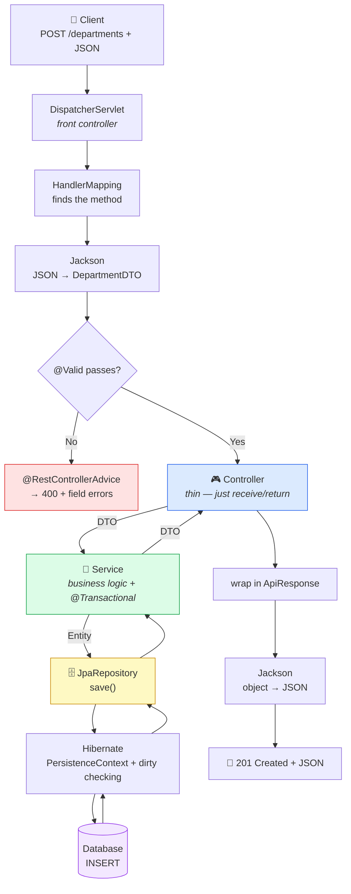

🧠 **The one-line narrative:** *DispatcherServlet routes → Jackson deserializes + `@Valid` validates → thin Controller hands a DTO to the Service → Service (transactional) maps to an Entity and calls the Repository → Hibernate tracks it in the persistence context and flushes SQL → result mapped back to a DTO → Jackson serializes to JSON with the right status code.* All of this runs on beans that Spring's IoC container created and wired for you.

🏆 **Layer mantra: C-S-R-D** → **C**ontroller (thin) → **S**ervice (brain) → **R**epository (CRUD) → **D**atabase. **DTO** at the top boundary, **Entity** at the bottom.

---

# 🌱 PART 1 — SPRING CORE & BOOT

## 1️⃣ What is Spring? IoC vs DI

> **Spring = a Dependency Injection framework that makes Java apps *loosely coupled*.** You build the app from POJOs and Spring wires + manages them for you.

- Created by **Rod Johnson** — idea from his **2002** book; Spring Framework **1.0 released in 2004**. (🔧 Not "2003" — small fact, worth getting right.)
- Applies enterprise services to plain objects **non-invasively** — your classes stay clean, no framework base-classes needed.

### IoC vs DI — the classic question

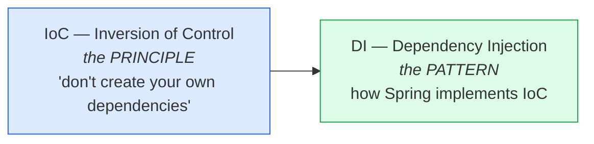

- **IoC** = the *principle*: an object should **not** control creation of its dependencies; control is *inverted* to the container.
- **DI** = the *technique* Spring uses to apply IoC — it **injects** dependencies into your beans.

🧠 **Loose coupling in one line:** depend on an **interface**, not on `new SomeConcreteClass()`. Spring hands you the concrete object at runtime → swap implementations without touching the class.

### What the IoC Container does

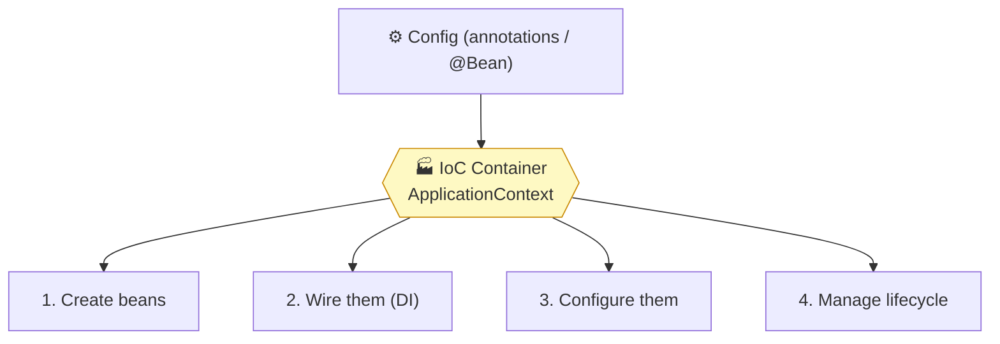

> The container most apps use is **`ApplicationContext`** (a superset of the older `BeanFactory`). `SpringApplication.run(...)` returns one.

🧠 **C-W-C-M** → **C**reate, **W**ire, **C**onfigure, **M**anage.

---

## 2️⃣ Beans

> A **bean** = an object **instantiated, assembled, and managed by the Spring IoC container.** Beans are the building blocks wired together to form the app.

### Two ways to define a bean

```java
// WAY 1 — Stereotype annotations (Spring scans + auto-registers)
@Component      // generic bean
@Service        // business layer
@Repository     // data layer (also translates DB exceptions)
@Controller     // web layer (returns views)
@RestController // REST web layer (= @Controller + @ResponseBody)

// WAY 2 — Explicit @Bean in a @Configuration class (best for 3rd-party classes you can't annotate)
@Configuration
public class AppConfig {
    @Bean
    public MyService myService() { return new MyService(); }  // YOU build it, Spring manages it
}
```

### Stereotypes are all specializations of @Component

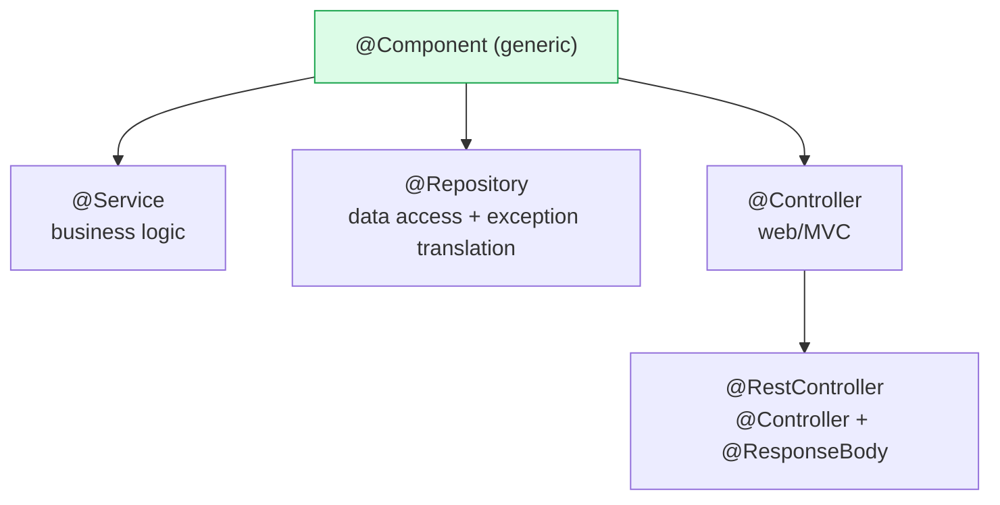

> They behave like `@Component` but document **intent**; `@Repository` additionally translates DB exceptions. Use the specific one for clarity.

### Bean Lifecycle

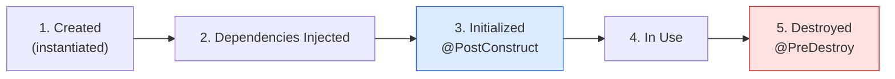

```java
@Component
public class CacheManager {
    @PostConstruct void init()    { /* runs AFTER construction + DI — warm cache, open resources */ }
    @PreDestroy   void cleanup()  { /* runs just BEFORE destruction — flush, close connections */ }
}
```

> 🔧 In Spring Boot 3, `@PostConstruct`/`@PreDestroy` live in **`jakarta.annotation.*`** (ship with `spring-boot-starter`).
> ⚠️ `@PreDestroy` is **not** called for `prototype` beans — Spring hands off a prototype and stops tracking it.

### Bean Scopes

| Scope | One instance per… | Context |
|---|---|---|
| **singleton** *(default)* | the whole IoC container | any |
| **prototype** | every request (`getBean`) | any |
| **request** | one HTTP request | web |
| **session** | one HTTP session | web |
| **application** | the `ServletContext` lifecycle | web |
| **websocket** | one WebSocket session | web |

🧠 **singleton vs prototype:** singleton = one shared office printer; prototype = a fresh disposable cup each time.

---

## 3️⃣ Dependency Injection

> **DI** = a component does **not** create its own dependencies; they are **injected** from outside (by Spring).

| Benefit | Why it matters |
|---|---|
| **Loose coupling** | classes depend on interfaces, not `new` calls |
| **Flexible config** | swap implementations without changing the class |
| **Testability** | inject mocks/fakes in unit tests easily |

### The 3 types of DI

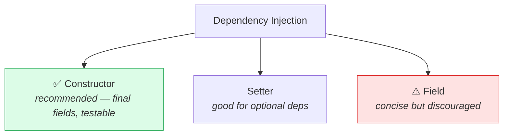

```java
// ✅ CONSTRUCTOR INJECTION (recommended)
@Component
public class CakeBaker {
    private final Frosting frosting;     // can be final → immutable
    private final Syrup syrup;
    public CakeBaker(Frosting frosting, Syrup syrup) {   // @Autowired optional (single ctor, Spring 4.3+)
        this.frosting = frosting; this.syrup = syrup;
    }
}

// SETTER (optional deps) | ⚠️ FIELD (@Autowired on field — can't be final, hidden deps, hard to test)
```

🧠 **Why constructor injection wins:** allows `final` fields, makes dependencies explicit, fails fast if a dependency is missing, and needs no reflection to test.

### 🍰 The Bakery example (the one to remember)

> `CakeBaker` bakes a cake. It needs **Frosting** and **Syrup** but never *makes* them — Spring injects them. Switch the cake flavour just by changing the wiring; the baking logic never changes. **That's the power of DI.**

```java
public interface Frosting { String getFrostingType(); }   // contract → loose coupling
@Component public class ChocolateFrosting implements Frosting { public String getFrostingType(){ return "Chocolate"; } }
@Component public class StrawberryFrosting implements Frosting { public String getFrostingType(){ return "Strawberry"; } }

@Component
public class CakeBaker {
    private final Frosting frosting;
    public CakeBaker(@Qualifier("chocolateFrosting") Frosting frosting) {  // pick WHICH impl
        this.frosting = frosting;
    }
}
```

🔁 **Switch to strawberry** → change only the `@Qualifier` value. Logic stays identical.

### When 2+ beans match one type

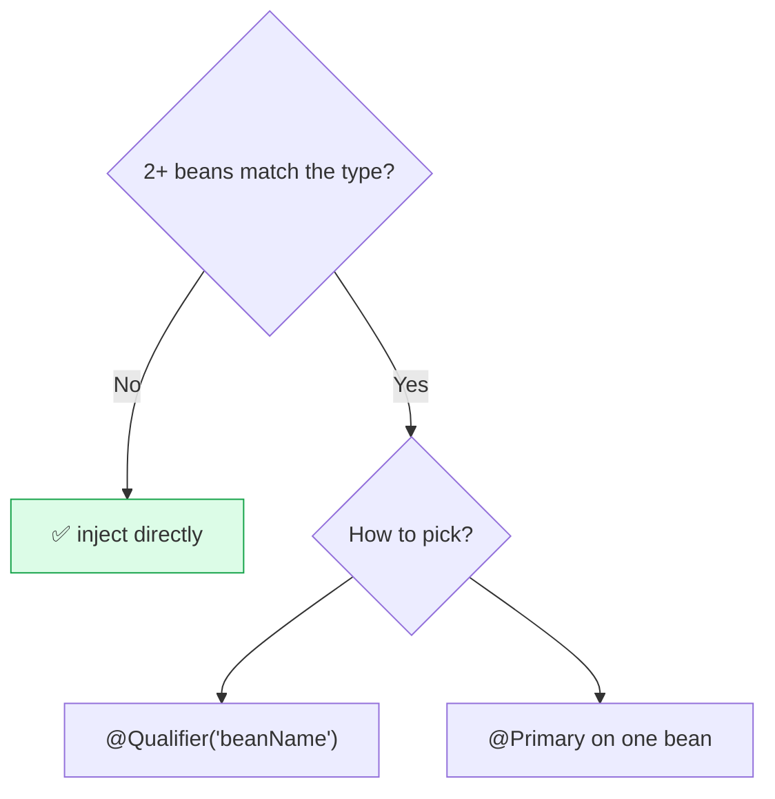

- **`@Qualifier("name")`** at the injection point — bean name defaults to the decapitalized class name (`ChocolateFrosting` → `chocolateFrosting`).
- **`@Primary`** on one impl → the default winner.
- ⚠️ Without either → `NoUniqueBeanDefinitionException` (expected 1, found 2).

---

## 4️⃣ Spring Boot vs Spring + Auto-Configuration

> **Spring Boot = Spring Framework + Auto-Configuration + Embedded Server + Starters.** It removes boilerplate so you ship faster.

| Feature | Spring Framework | Spring Boot |
|---|---|---|
| Configuration | manual XML / Java | **auto-configuration** |
| Server | deploy WAR to external server | **embedded** Tomcat/Jetty (run a JAR) |
| Dependencies | manage versions manually | **starter** deps, versions managed |
| Production features | extra setup | built-in **Actuator** (health/metrics) |

### Spring Boot's 5 key features — 🧠 "S-A-E-E-M"

1. **S**tarter dependencies — one dep pulls in everything (`spring-boot-starter-web`).
2. **A**uto-configuration — detects classpath, configures sensible defaults.
3. **E**xternalized config — `application.properties` / `.yaml` / env vars.
4. **E**mbedded servers — Tomcat/Jetty bundled; just run the JAR.
5. **M**etrics & health — Spring **Actuator** (`/actuator/health`).

### How auto-configuration works

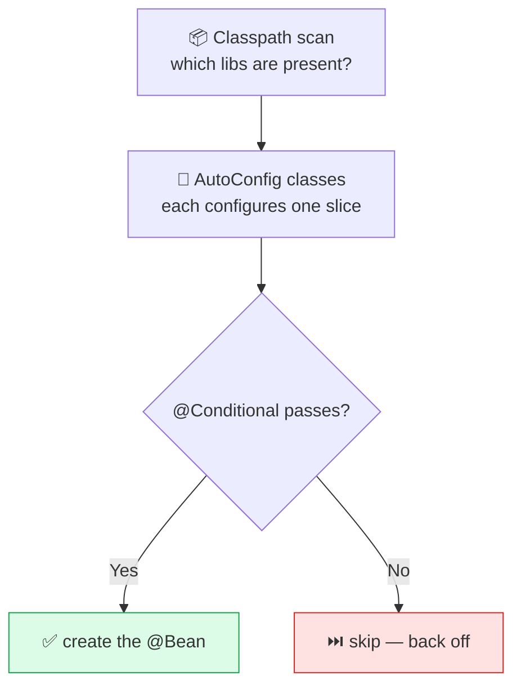

```java
@ConditionalOnClass(DataSource.class)        // only if class on classpath
@ConditionalOnMissingBean(DataSource.class)  // only if user hasn't defined this bean ← the "back-off"
@ConditionalOnProperty("my.feature.enabled") // only if property set
```

🧠 **Why does my custom `@Bean` override Boot's default?** Boot's auto-config beans are guarded by **`@ConditionalOnMissingBean`** — define your own and Boot "backs off."

### `@SpringBootApplication` decoded

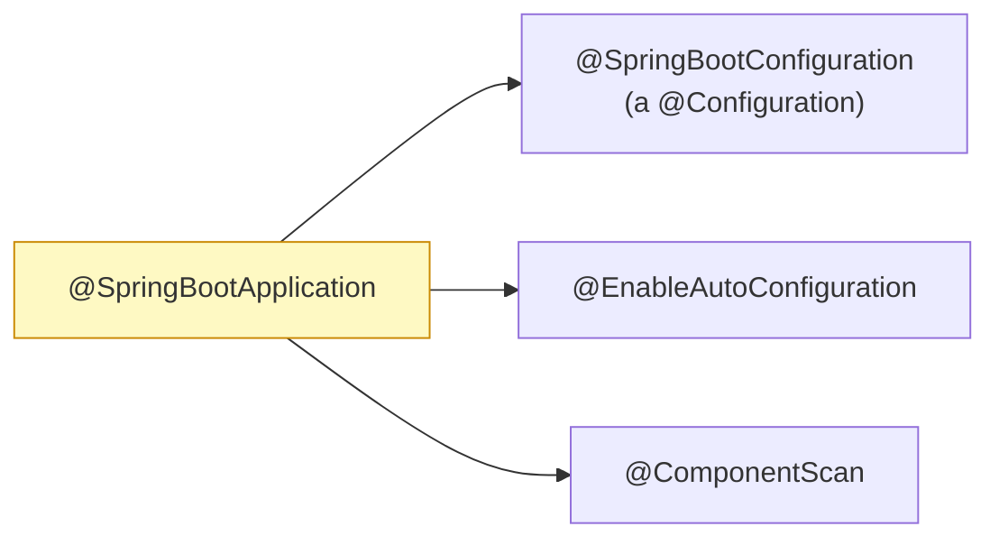

### Startup flow

`SpringApplication.run()` → create `ApplicationContext` → scan classpath → auto-config (`@Conditional`) → load externalized config → start embedded server → instantiate beans + DI + `@PostConstruct` → **Application Ready ✅**.

---

## 5️⃣ Maven (quick)

> **Maven = build automation + dependency management.** `pom.xml` is the recipe.

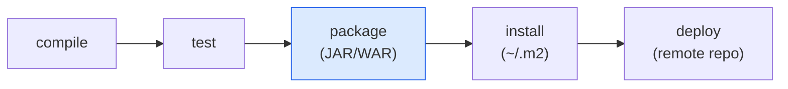

| Command | Purpose |
|---|---|
| `mvn clean` | wipe `target/` |
| `mvn clean package` | everyday combo — wipe + rebuild JAR |
| `mvn spring-boot:run` | run from source |
| `mvn spring-boot:build-image` | build a Docker/OCI image |

- `spring-boot-starter-parent` → build defaults + imports `spring-boot-dependencies`.
- `spring-boot-dependencies` → a **BOM** that pins versions → you usually don't specify versions.

---

# 🌐 PART 2 — WEB LAYER (MVC & REST)

## 6️⃣ REST + Layered Architecture

> **REST (Representational State Transfer)** = resource-based conventions. Every URL is a *resource*; the **HTTP method** is the *action*.

| Method | URL | Action |
|---|---|---|
| `GET` | `/users` / `/users/{id}` | get all / get one |
| `POST` | `/users` | create |
| `PUT` | `/users/{id}` | full update |
| `PATCH` | `/users/{id}` | partial update |
| `DELETE` | `/users/{id}` | delete |

🧠 **Resource = noun, method = verb.** URL says *what*, method says *do what*. Avoid verbs in URLs (`/getUser` ❌).

### `spring-boot-starter-web` bundles everything for REST

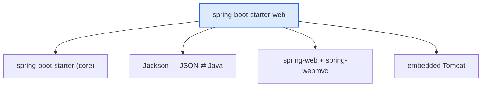

### Layered (MVC) architecture

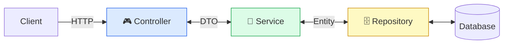

| Benefit | Meaning |
|---|---|
| Separation of concerns | each layer has one job |
| Reusability | service/repo reused across controllers |
| Testability | each layer unit-tested in isolation |
| Scalability | layers replaced/scaled independently |

🧠 Controllers should be **thin**; the brains live in the **service**.

---

## 7️⃣ Spring MVC Request Lifecycle

> The **DispatcherServlet** is the front controller that routes every request.

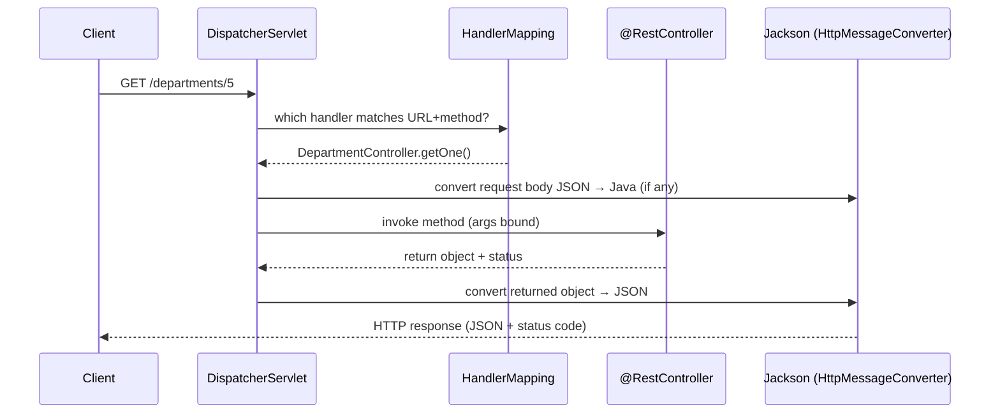

1. **DispatcherServlet** receives every request.
2. **HandlerMapping** finds the controller method matching URL + HTTP method.
3. **HttpMessageConverter** (Jackson) converts request JSON → Java (`@RequestBody`) and return value → JSON.
4. Controller runs, returns an object; Spring serializes it back.

> ✅ With `@RestController` you return plain objects — Jackson turns them into JSON. No view resolver.

---

## 8️⃣ Controllers, Mapping & Getting Data In

### @Controller vs @RestController

| Annotation | Returns | Use for |
|---|---|---|
| `@Controller` | a **View** (HTML) | server-rendered pages |
| `@RestController` | **JSON/XML** (= `@Controller` + `@ResponseBody`) | **REST APIs** ✅ |

```java
@RestController
@RequestMapping("/departments")               // base path for the class
public class DepartmentController {
    @GetMapping                               // GET /departments
    public List<DepartmentDTO> getAll() { ... }

    @GetMapping("/{id}")                       // GET /departments/5
    public DepartmentDTO getOne(@PathVariable Long id) { ... }

    @PostMapping                               // POST /departments
    public ResponseEntity<DepartmentDTO> create(@Valid @RequestBody DepartmentDTO dto) { ... }
}
```

`@GetMapping`/`@PostMapping`/etc. are shortcuts for `@RequestMapping(method = ...)`.

### Three ways the client sends data in

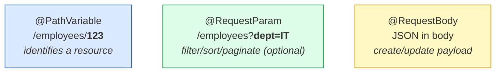

```java
@GetMapping("/employees/{id}")
public Employee get(@PathVariable Long id) { ... }                  // /employees/123

@GetMapping("/employees")
public List<Employee> list(@RequestParam(required=false) String department,
                           @RequestParam(defaultValue="0") int page) { ... }  // /employees?department=IT

@PostMapping("/users")
public ResponseEntity<User> create(@RequestBody User user) { ... }  // JSON body → Java via Jackson
```

🧠 **Path = identity, Param = options.** Remove it and it points to a *different thing* → path variable. It just *narrows/filters* → request param.

---

## 9️⃣ HTTP Methods, Status Codes & Idempotency

| Method | Purpose | Idempotent? | Typical success status |
|---|---|---|---|
| `GET` | read | ✅ | **200 OK** |
| `POST` | create | ❌ | **201 Created** |
| `PUT` | full replace | ✅ | 200 / 204 |
| `PATCH` | partial update | ⚠️ usually no | 200 OK |
| `DELETE` | remove | ✅ | **204 No Content** |

🧠 **Idempotency (favourite):** calling it many times = same effect as once. **GET, PUT, DELETE are idempotent; POST is not** (two POSTs = two resources).

| Code | When |
|---|---|
| 200 OK | GET/PUT/PATCH success |
| 201 Created | POST success |
| 204 No Content | DELETE success |
| 400 Bad Request | validation failed |
| 404 Not Found | id not found |
| 500 Internal Server Error | unhandled bug |

> ⚠️ **Trap:** don't confuse the English word "found" with HTTP **302** (a *redirect*). A successful GET is **200**, not 302.

```java
@PostMapping
public ResponseEntity<DepartmentDTO> create(@Valid @RequestBody DepartmentDTO dto) {
    return ResponseEntity.status(HttpStatus.CREATED).body(service.create(dto)); // 201
}
@DeleteMapping("/{id}")
public ResponseEntity<Void> delete(@PathVariable Long id) {
    service.delete(id);
    return ResponseEntity.noContent().build();                                   // 204
}
```

> **`ResponseEntity<T>`** lets you control body **and** status code (and headers). Prefer it when status matters.

---

## 🔟 DTO vs Entity + Service Layer

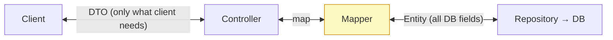

| | **Entity** | **DTO** |
|---|---|---|
| Purpose | maps to a DB table | carries data between layers |
| Used in | repository layer | controller / service layer |
| Annotation | `@Entity` | plain POJO |
| Exposes | all DB fields | only what the client needs |

✅ **Why separate?** Hides DB internals, avoids over-exposing fields (e.g. passwords), prevents accidental lazy-loading serialization, lets the API contract evolve independently from the schema.
🔧 Map DTO↔Entity with **MapStruct** (compile-time, fast) — avoid hand-writing large mappers.

### Service layer = the brain 🧠

```java
@Service
public class DepartmentService {
    private final DepartmentRepository repository;
    public DepartmentService(DepartmentRepository repository) { this.repository = repository; } // ctor injection ✅

    public Department getDepartment(Long id) {
        return repository.findById(id)
            .orElseThrow(() -> new ResourceNotFoundException("Department not found: " + id));
    }
}
```

Holds business logic, validation, orchestration — keeps controllers thin and logic reusable/testable.

---

## 1️⃣1️⃣ Validation

Add `spring-boot-starter-validation`, then put `@Valid` on the `@RequestBody`:

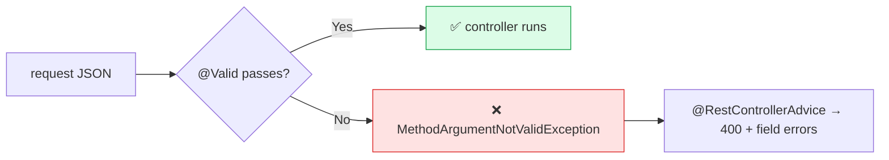

### Built-in constraints (🔧 `jakarta.validation.constraints.*`)

| Annotation | Checks |
|---|---|
| `@NotNull` / `@NotEmpty` / `@NotBlank` | not null / + size>0 / + non-whitespace text |
| `@Size(min,max)` | length/size |
| `@Min` / `@Max` / `@Positive` | numeric bounds |
| `@Email` / `@Pattern` | format / regex |
| `@Past` / `@Future` | date |
| `@DecimalMin` / `@DecimalMax` | decimal bounds |

🧠 **Strictness:** `@NotNull` < `@NotEmpty` < `@NotBlank`. (`NotNull` allows `""`; `NotEmpty` needs size>0; `NotBlank` needs real text, strings only.)

> ⚠️ **Trap:** `@Min`/`@Max` are **number-only**. On a `String` they throw `UnexpectedTypeException`. Use **`@Size`**/`@Length` for string length.

### Custom validation — 2 steps

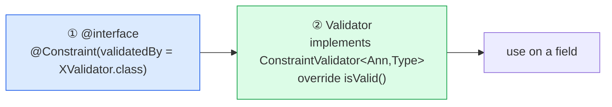

```java
// ① the annotation
@Target({ElementType.FIELD}) @Retention(RetentionPolicy.RUNTIME)
@Constraint(validatedBy = PrimeNumberValidator.class)
public @interface PrimeNumberValidation {
    String message() default "Number should be Prime!";
    Class<?>[] groups() default {};                   // ← these 3 members are
    Class<? extends Payload>[] payload() default {};  //   MANDATORY (Bean Validation spec)
}

// ② the validator
public class PrimeNumberValidator implements ConstraintValidator<PrimeNumberValidation, Integer> {
    @Override public boolean isValid(Integer n, ConstraintValidatorContext ctx) {
        if (n == null || n < 2) return false;
        for (int i = 2; i * i <= n; i++) if (n % i == 0) return false;
        return true;
    }
}
// usage: @PrimeNumberValidation private Integer primeNumber;
```

---

## 1️⃣2️⃣ Exception Handling + Response Wrapper

> **Goal:** no crashes, no raw stack traces to clients, **consistent** error responses everywhere.

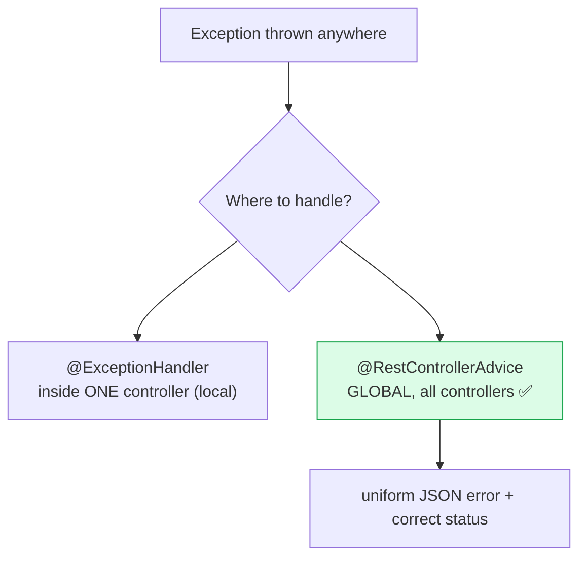

```java
@RestControllerAdvice                         // ✅ global, recommended
public class GlobalExceptionHandler {

    @ExceptionHandler(ResourceNotFoundException.class)
    public ResponseEntity<?> handleNotFound(ResourceNotFoundException ex) {
        return ResponseEntity.status(HttpStatus.NOT_FOUND).body(ex.getMessage());   // 404
    }

    @ExceptionHandler(MethodArgumentNotValidException.class)   // validation → 400
    public ResponseEntity<?> handleValidation(MethodArgumentNotValidException ex) {
        Map<String,String> errs = new HashMap<>();
        ex.getBindingResult().getFieldErrors()
          .forEach(f -> errs.put(f.getField(), f.getDefaultMessage()));
        return ResponseEntity.badRequest().body(errs);
    }

    @ExceptionHandler(Exception.class)                        // catch-all → 500 (LAST)
    public ResponseEntity<?> handleGeneral(Exception ex) {
        return ResponseEntity.status(HttpStatus.INTERNAL_SERVER_ERROR).body(ex.getMessage());
    }
}
```

> 🔧 **Order matters:** Spring picks the **most specific** matching handler. Keep `Exception.class` as the last-resort catch-all.
> 🔧 **Alternative:** `@ResponseStatus(HttpStatus.NOT_FOUND)` on the exception class sets the status without a handler — handy for simple cases.

### Consistent API response envelope

```json
{ "data": { "id": 5, "title": "IT" }, "error": null, "timeStamp": "10:30:00 31-05-2026" }
```
```json
{ "data": null, "error": { "status": "NOT_FOUND", "message": "Department not found: 5" }, "timeStamp": "..." }
```

🧠 **One envelope for all:** success and error share the same outer shape (`data` / `error` / `timeStamp`) → the front-end never has to guess the format.

---

## 1️⃣3️⃣ Lombok

> Generates boilerplate at compile time via annotations.

| Annotation | Generates |
|---|---|
| `@Data` | getters, setters, `toString`, `equals`, `hashCode`, required-args ctor |
| `@Getter` / `@Setter` | getters / setters |
| `@NoArgsConstructor` / `@AllArgsConstructor` | constructors |
| `@Builder` | builder pattern |

```java
@Getter @Setter @NoArgsConstructor @AllArgsConstructor
public class DepartmentDTO { private String id; private String title; private Boolean isActive; }
```

> ⚠️ On JPA **entities**, avoid `@Data` / `@EqualsAndHashCode` on all fields and `@ToString` over lazy associations — they can trigger lazy loading or recursion. Prefer `@Getter`/`@Setter` + explicit `equals`/`hashCode` on the id.

---

# 🗄️ PART 3 — PERSISTENCE (HIBERNATE & SPRING DATA JPA)

## 1️⃣4️⃣ JDBC vs Hibernate vs JPA vs Spring Data JPA

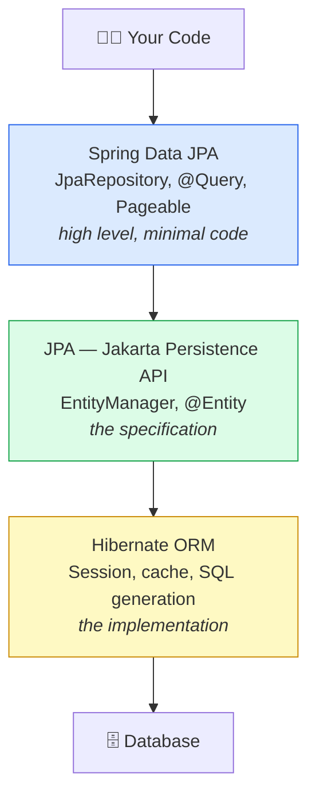

🧠 **Analogy:** JDBC = manual gear car (do everything yourself) · Hibernate = automatic car · JPA = the "car interface" (defines that gears must exist) · Spring Data JPA = self-driving car (just give the destination).

🏆 **One-liner:** *JPA is the specification, Hibernate is the implementation, Spring Data JPA is the abstraction on top that auto-generates queries.*

```java
// Same fetch, four ways — Spring Data JPA is one line:
public interface EmployeeRepository extends JpaRepository<Employee, Long> {}
employeeRepository.findById(1L);   // findById already inherited
```

---

## 1️⃣5️⃣ Entities, Keys & Relationships

```
Class ⟷ Table   ·   Field ⟷ Column   ·   Object ⟷ Row   ·   Annotation ⟷ Constraint
```

```java
@Entity @Table(name = "employees")
public class Employee {
    @Id @GeneratedValue(strategy = GenerationType.IDENTITY) private Long id;       // auto-increment PK
    @Column(name = "emp_name", nullable = false, length = 100) private String name;
    @Column(precision = 10, scale = 2) private BigDecimal salary;                 // DECIMAL(10,2)
    @Enumerated(EnumType.STRING) private EmployeeStatus status;                    // ✅ STRING, not ORDINAL
    private LocalDateTime createdAt;                                              // 🔧 java.time — no @Temporal
    @Lob private byte[] profileImage;                                            // BLOB/CLOB
    @Transient private String tempData;                                          // NOT persisted
}
```

> 🔧 Prefer `java.time` (`LocalDate`/`LocalDateTime`/`Instant`) → no `@Temporal`. Use `@Enumerated(EnumType.STRING)` — reordering enums silently corrupts `ORDINAL` data.

### PK generation strategies

| Strategy | How | Best for |
|---|---|---|
| **IDENTITY** | DB auto-increment | MySQL — most common |
| **SEQUENCE** | DB sequence, pre-allocates | PostgreSQL/Oracle — **best for batch inserts** |
| **TABLE** | separate ID table | portable but slow — avoid |
| **UUID** | app-generated UUID | distributed systems |

> ⚠️ With **IDENTITY**, Hibernate **cannot batch inserts** (needs the generated id immediately). For high-volume inserts, use **SEQUENCE**.

### Relationships — the golden rules

| Relationship | Owner-side annotation | Example |
|---|---|---|
| One To One | `@OneToOne` + `@JoinColumn` | 1 User → 1 Passport |
| Many To One | `@ManyToOne` + `@JoinColumn` | Many Employees → 1 Department |
| One To Many | `@OneToMany(mappedBy=...)` | 1 Department → Many Employees |
| Many To Many | `@ManyToMany` + `@JoinTable` | Students ↔ Courses |

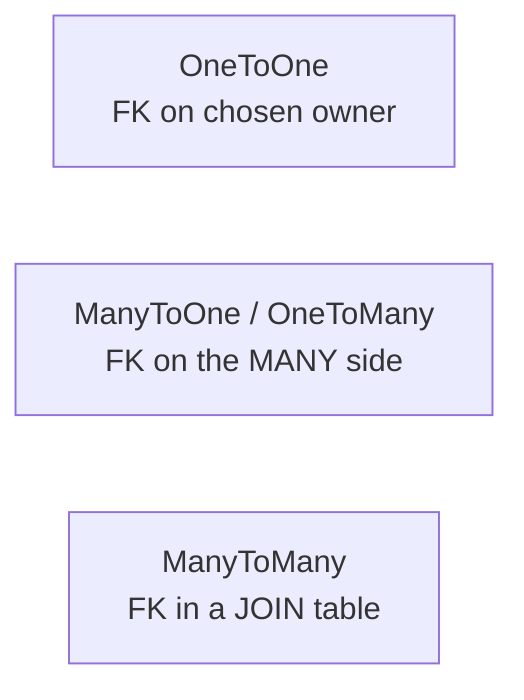

1. **FK rule** — FK lives on the *many* side; for `@ManyToMany` it lives in a join table.
2. **`mappedBy` rule** — always on the **inverse (non-owner)** side; its value = the field name on the owner.
3. **Owner rule** — owner = the entity whose table holds the FK (or, for M:N, the `@JoinTable` side).

```java
// ManyToOne is ALWAYS the owner (FK on the "many" side)
@Entity public class Employee {
    @ManyToOne(fetch = FetchType.LAZY)   // ✅ override the EAGER default
    @JoinColumn(name = "department_id")
    private Department department;
}
@Entity public class Department {
    @OneToMany(mappedBy = "department", cascade = CascadeType.ALL, orphanRemoval = true)
    private List<Employee> employees = new ArrayList<>();   // inverse side
}
```

🧠 **Hinglish hook:** `@ManyToOne` → "Mai (employee) kisi ek (department) ko belong karta hoon → FK meri table mein → mai OWNER." `@OneToMany` → "Mere bahut saare hain → FK meri table mein NAHI → mappedBy → mai INVERSE."

> ✅ **Pro tip:** In real projects prefer a **join entity** (`Enrollment` with `@ManyToOne` to both sides) over raw `@ManyToMany` — you almost always need extra columns (grade, enrolledOn).

---

## 1️⃣6️⃣ Entity Lifecycle + Persistence Context + Caching

```mermaid
stateDiagram-v2
    [*] --> Transient: new Employee()
    Transient --> Persistent: persist() / save()
    Persistent --> Detached: detach() / clear() / close()
    Detached --> Persistent: merge()
    Persistent --> Removed: remove()
    Removed --> [*]: flush (DELETE)
    Persistent --> Persistent: dirty checking → auto UPDATE
```

| State | In PC? | Has ID? | Changes tracked? |
|---|:---:|:---:|:---:|
| **Transient** (just `new`-ed) | ❌ | ❌ | ❌ |
| **Persistent** (managed) | ✅ | ✅ | ✅ auto-synced |
| **Detached** (was managed) | ❌ | ✅ | ❌ |
| **Removed** (marked for delete) | ✅ | ✅ | deleted on flush |

### Persistence Context = the L1 cache

> The **Persistence Context (PC)** is a "box" of managed entities Hibernate tracks within one `EntityManager`. It **is the L1 cache.**

```mermaid
sequenceDiagram
    participant App
    participant PC as Persistence Context (L1)
    participant DB
    App->>PC: em.find(Employee, 1)
    PC->>DB: SELECT ... WHERE id=1
    DB-->>PC: row → managed entity (snapshot saved)
    App->>PC: emp.setName("Updated")
    Note over PC: change recorded, NO SQL yet
    App->>PC: flush/commit
    PC->>DB: UPDATE ... (dirty checking)
    App->>PC: em.find(Employee, 1) again
    Note over PC: L1 HIT — no SQL, same reference
```

### Dirty checking 🧠

At load, Hibernate stores a **snapshot**. At flush, it compares current vs snapshot → only changed fields → auto `UPDATE`. **For a managed entity you never call `save()` to update — just mutate it inside a transaction.**

| Method | Effect |
|---|---|
| `find(Class,id)` | SELECT now; `null` if missing |
| `getReference(Class,id)` | lazy proxy, SQL only on access; `EntityNotFoundException` if missing |
| `persist(e)` | INSERT on flush (throws if detached) |
| `merge(e)` | INSERT-or-UPDATE; **returns a managed copy** (original stays detached) |
| `remove(e)` | DELETE on flush |
| `flush()` | push changes to DB (no commit) |

### Cache levels

| | L1 | L2 |
|---|---|---|
| Scope | per `EntityManager`/Session | per `SessionFactory`, shared |
| On by default? | ✅ always | ❌ optional (`@Cacheable` + provider) |
| Cleared | at tx end | configurable |

✅ Use L2 for **rarely-changing master data** (country, config). ❌ Avoid for write-heavy/real-time data.
🔧 In Hibernate 6 / Boot 3, L2 uses **JCache + EhCache 3** (`JCacheRegionFactory`), properties under `jakarta.*`.

---

## 1️⃣7️⃣ Cascade, orphanRemoval, Fetch & the N+1 Problem

### Cascade — propagate the parent's operation to children

| Relationship | Recommended cascade | Why |
|---|---|---|
| `@OneToOne` (User–Passport) | `ALL` | passport can't outlive its user |
| `@OneToMany` (Dept–Employee) | `ALL` + `orphanRemoval=true` | children belong to parent |
| `@ManyToOne` (Employee–Dept) | **none** | deleting an employee must NOT delete the dept |
| `@ManyToMany` (Student–Course) | `{PERSIST, MERGE}` only | ❌ `ALL`/`REMOVE` deletes shared rows |

> ⚠️ **Never put cascade on both sides** of a bidirectional relationship → infinite recursion / accidental mass-delete.

### orphanRemoval vs CascadeType.REMOVE

| `CascadeType.REMOVE` | `orphanRemoval = true` |
|---|---|
| delete **parent** → all children deleted | remove **one child** from collection → that child deleted |
| bulk delete | selective delete |

### FetchType + the N+1 Problem (⭐ THE favourite)

| FetchType | Behaviour | Default on |
|---|---|---|
| **EAGER** | load immediately (JOIN) | `@ManyToOne`, `@OneToOne` |
| **LAZY** | load only on access (proxy) | `@OneToMany`, `@ManyToMany` |

```mermaid
flowchart TD
    Q1["Query 1: SELECT * FROM department → 100 rows"] --> L["for each → d.getEmployees()"]
    L --> Q2["Query 2: employees WHERE dept_id=1"]
    L --> QN["...Query 101: employees WHERE dept_id=100"]
    QN --> T["💀 TOTAL = 1 + 100 = 101 queries"]
    style T fill:#fee2e2,stroke:#dc2626
```

> N+1 strikes with **LAZY accessed in a loop** *and* with **EAGER on a collection**.

### ✅ Four solutions

| Solution | How | Best for |
|---|---|---|
| **JOIN FETCH** | `@Query("... JOIN FETCH d.employees")` | specific queries |
| **@EntityGraph** | `@EntityGraph(attributePaths={"employees"})` | declarative, no JPQL (LEFT JOIN) |
| **Batch fetching** | `hibernate.default_batch_fetch_size=50` | global safety net (N+1 → N/batch via `IN`) |
| **DTO projection** | `SELECT new ...DTO(...)` | best performance, only needed columns |

> ⚠️ **LazyInitializationException** = accessing a LAZY association after the session closed. Fix: keep the tx open (`@Transactional`), `JOIN FETCH`, `@EntityGraph`, or DTO projection.
> ⚠️ **JOIN FETCH of a collection + `Pageable`** can't paginate in the DB — Hibernate pages in memory. Use `@EntityGraph` + batch size, or fetch IDs first.

---

## 1️⃣8️⃣ Transactions

> **Transaction = one unit of work — all of it commits, or none of it (ROLLBACK).**

```java
@Transactional
public void createDepartmentWithEmployees() {
    Department d = new Department("IT");
    d.addEmployee(new Employee("Rahul"));
    departmentRepository.save(d);
    // error anywhere → entire thing rolls back
}
```

| Property | Purpose | Default |
|---|---|---|
| `readOnly` | skip dirty checking (faster reads) | `false` |
| `rollbackFor` | which exceptions roll back | `RuntimeException` only |
| `propagation` | how it joins/creates txns | `REQUIRED` |
| `isolation` | DB isolation level | `DEFAULT` |

> ⚠️ By default Spring rolls back only on **unchecked** exceptions. For checked exceptions: `@Transactional(rollbackFor = Exception.class)`.

### Propagation

| Propagation | Behaviour |
|---|---|
| **REQUIRED** *(default)* | join existing tx, else create new |
| **REQUIRES_NEW** | always new tx; suspend current (e.g. audit logging that must survive a rollback) |
| **MANDATORY** | must already be in a tx, else error |
| **NESTED** | nested savepoint |

### ⚠️ Self-invocation trap (asked a lot)

```java
@Service public class EmployeeService {
    @Transactional public void method1() { ... }
    public void method2() { this.method1(); }   // ❌ @Transactional IGNORED — proxy bypassed
}
```

`@Transactional` works via a Spring **proxy**. A `this.method1()` self-call skips the proxy → no transaction. Fix: move to another bean, inject self, or `AopContext.currentProxy()`.
⚠️ Only **public** methods are proxied (default Spring AOP).

---

## 1️⃣9️⃣ Queries, Pagination & Projections

### Derived query methods (Spring builds SQL from the method name)

```java
List<Employee> findByName(String name);
List<Employee> findByNameAndDepartment(String name, String dept);
List<Employee> findBySalaryBetween(BigDecimal min, BigDecimal max);
List<Employee> findByNameContaining(String kw);     // %kw%
List<Employee> findByDepartmentOrderBySalaryDesc(String d);
List<Employee> findTop10ByOrderBySalaryDesc();
boolean        existsByEmail(String e);
```

### @Query — JPQL & native

```java
@Query("SELECT e FROM Employee e WHERE e.department = :dept AND e.salary > :min")  // JPQL: entity+field names
List<Employee> find(@Param("dept") String dept, @Param("min") BigDecimal min);

@Modifying                                                                         // required for UPDATE/DELETE
@Query("UPDATE Employee e SET e.salary = :s WHERE e.department = :d")
int raiseSalary(@Param("s") BigDecimal s, @Param("d") String d);

@Query(value = "SELECT * FROM employees WHERE salary > :min", nativeQuery = true)  // native: table+column names
List<Employee> findHighEarners(@Param("min") BigDecimal min);
```

> ⚠️ `@Modifying` queries **must** run inside `@Transactional` and **bypass** the persistence context (stale L1 possible).

### Which query approach when?

| Approach | Use when |
|---|---|
| Derived names | simple, 1–2 fixed conditions |
| `@Query` (JPQL) | fixed complex query, known at dev time |
| `@Query` (native) | DB-specific SQL JPQL can't express |
| **Specification** | dynamic **optional** filters (search forms) |
| **QueryDSL** | complex dynamic, **type-safe** — best for big projects |

```java
// Specification — combine only provided filters (don't write 2ⁿ methods!)
Specification<Employee> spec = Specification.where(null);
if (name != null) spec = spec.and(EmployeeSpecs.hasName(name));
if (min  != null) spec = spec.and(EmployeeSpecs.salaryGoe(min));
employeeRepository.findAll(spec);
```

### Pagination & Sorting

```java
Pageable pageable = PageRequest.of(0, 10, Sort.by("name").ascending());  // page 0, size 10
Page<Employee> page = employeeRepository.findAll(pageable);
page.getTotalElements(); page.getTotalPages(); page.hasNext();
// Spring MVC injects Pageable directly: GET /employees?page=0&size=10&sort=name,asc
```

| | runs COUNT? | knows total pages? | use for |
|---|:---:|:---:|---|
| **`Page`** | ✅ | ✅ | numbered pagination |
| **`Slice`** | ❌ (faster) | ❌ | infinite scroll / "Load more" |

### Projections (fetch only needed columns)

```java
// 1) interface-based — getters match entity fields
public interface EmployeeNameOnly { Long getId(); String getName(); }
List<EmployeeNameOnly> findByDepartment(String dept);

// 2) class-based DTO (record + JPQL constructor expression)
public record EmployeeDTO(Long id, String name, String departmentName) {}
@Query("SELECT new com.app.dto.EmployeeDTO(e.id, e.name, d.name) FROM Employee e JOIN e.department d")
List<EmployeeDTO> findAllDTOs();
```

### Repository hierarchy

```mermaid
flowchart TD
    R["Repository (marker)"] --> C["CrudRepository<br/>save, findById, findAll, delete, count"]
    R --> P["PagingAndSortingRepository<br/>findAll(Sort), findAll(Pageable)"]
    C --> J["JpaRepository<br/>+ flush, saveAndFlush, deleteAllInBatch<br/>👉 USE THIS"]
    P --> J
```

> ⚠️ `deleteAll()` loads + deletes one-by-one (cascade + callbacks fire). `deleteAllInBatch()` runs **one** DELETE — fast, but no cascade/callbacks.

---

## 2️⃣0️⃣ Inheritance, Locking & Key Patterns

### Inheritance mapping

| Strategy | Tables | Trade-off |
|---|---|---|
| **SINGLE_TABLE** *(default)* | 1 + discriminator | fastest, no joins; but nullable subclass columns |
| **JOINED** | 1 per class + FK joins | normalized; slower (joins) |
| **TABLE_PER_CLASS** | 1 per concrete class | no joins per type; `UNION` for polymorphic queries |

✅ Default to **SINGLE_TABLE**; switch to **JOINED** when you need NOT-NULL on subclass columns.

### Locking — the lost-update problem

> Two threads read salary=50000, both write → one update silently lost.

| | Optimistic | Pessimistic |
|---|---|---|
| Mechanism | `@Version` check | DB row lock |
| Performance | better | slower |
| On conflict | exception (retry) | blocks |
| Deadlock | none | possible |
| Use for | low contention / web apps ✅ | money / inventory |

```java
@Version Long version;   // optimistic — UPDATE ... WHERE id=? AND version=? → 0 rows = OptimisticLockException

@Lock(LockModeType.PESSIMISTIC_WRITE)            // SELECT ... FOR UPDATE
@Query("SELECT e FROM Employee e WHERE e.id = :id")
Employee findByIdForUpdate(@Param("id") Long id);
```

### Soft delete (🔧 modern)

```java
@Entity
@SQLRestriction("deleted = false")                                  // auto-filter every query (replaces @Where)
@SQLDelete(sql = "UPDATE employee SET deleted = true WHERE id = ?") // DELETE → UPDATE
public class Employee { @Id Long id; String name; boolean deleted = false; }
// Hibernate 6.4+: just @SoftDelete(columnName = "deleted")
```

### Auditing — who/when, automatically

```java
@MappedSuperclass @EntityListeners(AuditingEntityListener.class)
public abstract class BaseEntity {
    @CreatedDate @Column(updatable=false) LocalDateTime createdAt;
    @LastModifiedDate                     LocalDateTime updatedAt;
    @CreatedBy   @Column(updatable=false) String createdBy;
    @LastModifiedBy                       String updatedBy;
}
// + @EnableJpaAuditing(auditorAwareRef = "auditorProvider"). Full history → Hibernate Envers (@Audited).
```

### @Embeddable — reusable column groups (value objects)

```java
@Embeddable public class Address { String street, city, state, zipCode; }  // NO @Id, NO own table
@Entity public class Employee { @Id Long id; @Embedded Address address; }   // columns live in employee table
```

---

## 2️⃣1️⃣ Performance Tuning

```java
// Batch inserts (needs SEQUENCE, not IDENTITY)
spring.jpa.properties.hibernate.jdbc.batch_size=50
@Transactional
public void bulkInsert(List<Employee> list) {
    for (int i = 0; i < list.size(); i++) {
        em.persist(list.get(i));
        if (i % 50 == 0) { em.flush(); em.clear(); }   // free PC memory, avoid OOM
    }
}
```

| Technique | What it does |
|---|---|
| `@Transactional(readOnly = true)` | skips dirty checking + snapshot → faster reports |
| `@DynamicUpdate` | UPDATE only changed columns |
| `@Immutable` | never modified → no dirty checking (lookup tables) |
| `hibernate.generate_statistics=true` | debug N+1 / query counts |
| HikariCP pool | `max-pool-size ≈ core_count*2 + spindles` |

🧠 **Debug N+1 in prod:** enable statistics + `org.hibernate.SQL=DEBUG`, watch query counts, use APM (New Relic/DataDog).

---

# 🎤 PART 4 — INTERVIEW CRAM

## 2️⃣2️⃣ Master Q&A (Self-Test)

> Read the question, answer in your head, then expand. These are the highest-frequency ones across all three modules.

### 🌱 Spring Core & Boot

<details><summary><b>Q1.</b> IoC vs DI?</summary>

IoC is the *principle* (don't create your own dependencies — control is inverted to the container). DI is the *technique/pattern* Spring uses to apply IoC by injecting dependencies into beans.
</details>

<details><summary><b>Q2.</b> Three types of DI — which is best and why?</summary>

Constructor (✅ recommended — allows `final` fields, explicit deps, fails fast, testable without reflection), setter (good for optional deps), field (concise but discouraged: can't be final, hidden deps, hard to test). Single constructor → `@Autowired` optional (Spring 4.3+).
</details>

<details><summary><b>Q3.</b> Bean lifecycle?</summary>

Created → dependencies injected → initialized (`@PostConstruct`) → in use → destroyed (`@PreDestroy`). Note: `@PreDestroy` doesn't fire for prototype beans.
</details>

<details><summary><b>Q4.</b> singleton vs prototype?</summary>

singleton (default) = one shared instance per container. prototype = a brand-new instance every time the bean is requested.
</details>

<details><summary><b>Q5.</b> Two beans match one type — how does Spring pick?</summary>

`@Qualifier("beanName")` at the injection point, or `@Primary` on one bean. Otherwise → `NoUniqueBeanDefinitionException`.
</details>

<details><summary><b>Q6.</b> What does @SpringBootApplication combine?</summary>

`@SpringBootConfiguration` (itself a `@Configuration`) + `@EnableAutoConfiguration` + `@ComponentScan`.
</details>

<details><summary><b>Q7.</b> How does auto-configuration work, and why does my custom @Bean override Boot's default?</summary>

Boot scans the classpath; many `@Configuration` classes create beans only when `@Conditional` checks pass. Defaults are guarded by `@ConditionalOnMissingBean`, so when you define your own bean, Boot "backs off."
</details>

### 🌐 Web / REST

<details><summary><b>Q8.</b> @Controller vs @RestController?</summary>

`@Controller` returns a view (HTML). `@RestController` = `@Controller` + `@ResponseBody`, returns JSON/XML directly. Use `@RestController` for REST APIs.
</details>

<details><summary><b>Q9.</b> How does a request flow through Spring MVC?</summary>

DispatcherServlet (front controller) → HandlerMapping finds the method → HttpMessageConverter (Jackson) converts body/return → controller runs → response serialized to JSON.
</details>

<details><summary><b>Q10.</b> @PathVariable vs @RequestParam?</summary>

`@PathVariable` reads from the URL path (`/users/5`) to identify a resource. `@RequestParam` reads from the query string (`/users?active=true`) for optional filtering/sorting/pagination.
</details>

<details><summary><b>Q11.</b> PUT vs PATCH? Which methods are idempotent?</summary>

PUT fully replaces; PATCH partially updates. GET, PUT, DELETE are idempotent (repeating = same effect). POST is not. PATCH is generally not guaranteed idempotent.
</details>

<details><summary><b>Q12.</b> DTO vs Entity — why separate them?</summary>

Entity maps to the DB (all fields); DTO is the API contract (only what the client needs). Separation hides internals, avoids over-exposing fields (e.g. passwords), prevents lazy-loading serialization issues, and lets API and schema evolve independently.
</details>

<details><summary><b>Q13.</b> @NotNull vs @NotEmpty vs @NotBlank?</summary>

`@NotNull`: not null (but `""` ok). `@NotEmpty`: not null and size > 0. `@NotBlank`: not null and has non-whitespace text (strings only). Strictness: NotNull < NotEmpty < NotBlank.
</details>

<details><summary><b>Q14.</b> @ExceptionHandler vs @RestControllerAdvice?</summary>

`@ExceptionHandler` handles exceptions within one controller. `@RestControllerAdvice` is global across all controllers — the recommended way to centralize error handling. Most specific handler wins; keep `Exception.class` as the last-resort catch-all.
</details>

### 🗄️ Hibernate / JPA

<details><summary><b>Q15.</b> JPA vs Hibernate vs Spring Data JPA?</summary>

JPA = the specification (interface). Hibernate = a JPA implementation. Spring Data JPA = an abstraction over JPA (auto-generated queries, pagination, far less boilerplate).
</details>

<details><summary><b>Q16.</b> What is the Persistence Context / dirty checking?</summary>

The PC is the L1 cache — the box of managed entities tracked within one EntityManager. Dirty checking compares each managed entity to its load-time snapshot at flush and auto-issues UPDATEs for changed fields. No explicit `save()` needed for managed entities.
</details>

<details><summary><b>Q17.</b> persist() vs merge()?</summary>

`persist()` = INSERT a new entity (fails for detached). `merge()` = INSERT or UPDATE; copies a detached entity's state into a managed instance and **returns that managed instance** (the argument stays detached).
</details>

<details><summary><b>Q18.</b> The N+1 problem and its solutions?</summary>

1 query loads N parents, then N queries load each parent's children. Fixes: `JOIN FETCH`, `@EntityGraph`, `@BatchSize`/`default_batch_fetch_size`, and DTO projection (best performance).
</details>

<details><summary><b>Q19.</b> LAZY vs EAGER (defaults)?</summary>

LAZY = load on access (default for `@OneToMany`/`@ManyToMany`). EAGER = load immediately (default for `@ManyToOne`/`@OneToOne`). Prefer LAZY and fetch explicitly when needed.
</details>

<details><summary><b>Q20.</b> Cascade for @ManyToMany — is ALL safe? And orphanRemoval vs REMOVE?</summary>

No — `REMOVE` would delete shared rows; use `{PERSIST, MERGE}`. `CascadeType.REMOVE` deletes all children when the parent is deleted; `orphanRemoval` deletes a specific child when it's removed from the parent's collection (selective).
</details>

<details><summary><b>Q21.</b> @Transactional propagation types + the self-invocation trap?</summary>

REQUIRED (default), REQUIRES_NEW, SUPPORTS, NOT_SUPPORTED, MANDATORY, NEVER, NESTED. `@Transactional` runs via a Spring proxy, so a `this.method()` self-call bypasses it (no transaction). Only public methods are proxied.
</details>

<details><summary><b>Q22.</b> Optimistic vs pessimistic locking?</summary>

Optimistic: `@Version` column; update includes `WHERE version=X`; 0 rows → `OptimisticLockException`. Best for low contention. Pessimistic: real DB row lock (`SELECT ... FOR UPDATE`); blocks others; best for high contention (money/inventory) but risks deadlocks.
</details>

<details><summary><b>Q23.</b> How to prevent LazyInitializationException?</summary>

Keep the session open with `@Transactional`, or use `JOIN FETCH`, `@EntityGraph`, a DTO projection, or `Hibernate.initialize()`.
</details>

<details><summary><b>Q24.</b> Page vs Slice?</summary>

`Page` runs a COUNT query and knows total pages (numbered pagination). `Slice` skips the COUNT (faster) and only knows if there's a next page (infinite scroll).
</details>

<details><summary><b>Q25.</b> deleteAll() vs deleteAllInBatch()?</summary>

`deleteAll()` loads entities and deletes one-by-one (callbacks + cascade fire). `deleteAllInBatch()` runs a single DELETE — fast, but no callbacks/cascade.
</details>

---

## 2️⃣3️⃣ Ultimate Cheat Sheet

```
═══ SPRING CORE ═══
Spring   = DI framework → loose coupling via POJOs
IoC      = principle (don't create your own deps)  |  DI = the pattern (injection)
Container= ApplicationContext → Create-Wire-Configure-Manage (C-W-C-M)
Beans    = @Component family OR @Bean in @Configuration
Lifecycle= created → DI → @PostConstruct → used → @PreDestroy
DI types = Constructor ✅ (final, testable) · Setter (optional) · Field ⚠️ (avoid)
Multiple match → @Qualifier("name") or @Primary
Boot     = Spring + Auto-config + Embedded server + Starters  (S-A-E-E-M)
@SpringBootApplication = @SpringBootConfiguration + @EnableAutoConfiguration + @ComponentScan

═══ WEB / REST ═══
Layers   = Controller(thin) → Service(brain) → Repository(CRUD) → DB   |  DTO top, Entity bottom
Lifecycle= DispatcherServlet → HandlerMapping → Jackson → controller → JSON
Data in  = @PathVariable (/users/5, identity) · @RequestParam (?x=1, filter) · @RequestBody (JSON)
Methods  = GET 200 ✅ · POST 201 ❌ · PUT 200 ✅ · PATCH 200 ⚠️ · DELETE 204 ✅
Errors   = 400 validation · 404 not found · 500 server   (NOT 302 — that's a redirect)
Validate = @Valid on @RequestBody → fail → MethodArgumentNotValidException → 400
           NotNull < NotEmpty < NotBlank  ·  @Min/@Max are number-only
Exceptions = @RestControllerAdvice (global) + @ExceptionHandler (specific first, Exception last)
Use ResponseEntity for body + status

═══ HIBERNATE / JPA ═══
Stack    = JPA(spec) → Hibernate(impl) → Spring Data JPA(abstraction)
Keys     = IDENTITY (MySQL) · SEQUENCE (Postgres/batch) · UUID (distributed)
Owner    = side with the FK (or @JoinTable for M:N) · inverse uses mappedBy
Cascade  = OneToOne ALL · OneToMany ALL+orphanRemoval · ManyToOne none · ManyToMany {PERSIST,MERGE}
Fetch    = Always LAZY → fetch explicitly (JOIN FETCH / @EntityGraph / DTO)
N+1 fix  = 1.JOIN FETCH  2.@EntityGraph  3.batch size  4.DTO projection (best)
Tx       = @Transactional on service; readOnly for reads; rollbackFor=Exception for checked
           ⚠️ self-invocation bypasses proxy; only public methods proxied
Lock     = Optimistic @Version (default) · Pessimistic @Lock (money/inventory)
Dirty checking → mutate managed entity inside a tx, no save() needed
persist=INSERT · merge=INSERT/UPDATE returns managed copy · getReference=lazy proxy
Page (COUNT, total pages) vs Slice (no COUNT, infinite scroll)
```

---

> **Night-before flow:** §0 (the whole story) → DI types (§3) → request lifecycle (§7) → N+1 (§17, *the* favourite) → transactions + self-invocation (§18) → then drill §22 with answers hidden. You've got this. 💪
