# 🌱 Module 1 — Spring Boot Introduction: Complete Revision Notes

> **One file. Visual-first. Built to learn fast + remember + crack interviews.**
> Same style as the Hibernate/JPA notes: Mermaid diagrams + clean tables + collapsible self-test + 🔧 *modern* (Spring Boot 3 / `jakarta.*`) notes.

---

## 🧭 How to use these notes

| Symbol | Meaning |
|:---:|---|
| 🔧 **Fix / Modern** | A correction or a Spring Boot 3 / `jakarta` update to the original notes |
| ✅ / ❌ | Do this / avoid this |
| ⚠️ | Common trap |
| 🧠 | Memory trick |
| 🏆 | Cheat sheet |

Interview prep? Jump to [§9 Self-Test Q&A](#9--self-test-qa) — answers are **collapsed** so you can quiz yourself.

---

## 📚 Table of Contents

1. [The Big Picture — What is Spring?](#1--the-big-picture--what-is-spring)
2. [IoC Container & the Core Idea](#2--ioc-container--the-core-idea)
3. [Beans (definition, stereotypes, lifecycle, scopes)](#3--beans)
4. [Dependency Injection (3 types + Bakery analogy)](#4--dependency-injection)
5. [Spring Boot vs Spring Framework](#5--spring-boot-vs-spring-framework)
6. [Auto-Configuration & Internal Startup Flow](#6--auto-configuration--internal-startup-flow)
7. [Maven](#7--maven)
8. [Annotations Reference](#8--annotations-reference)
9. [Self-Test Q&A](#9--self-test-qa)
10. [Cheat Sheet + Corrections Log](#10--cheat-sheet--corrections-log)

---

## 1️⃣ The Big Picture — What is Spring?

> **Spring = a Dependency Injection framework that makes Java apps *loosely coupled*.**
> You build the app from **POJOs** (Plain Old Java Objects) and Spring wires + manages them for you.

- Created by **Rod Johnson** — grew out of his 2002 book; Spring Framework **1.0 released in 2004**.
- Applies enterprise services to plain objects **non-invasively** (your classes stay clean, no framework base-classes needed).

> 🔧 **Fix:** The original note says "developed in 2003." More precisely: the idea came from Rod Johnson's **2002** book and the framework's **first release was 2004**. (Small fact — worth getting right in interviews.)

### Spring Framework modules

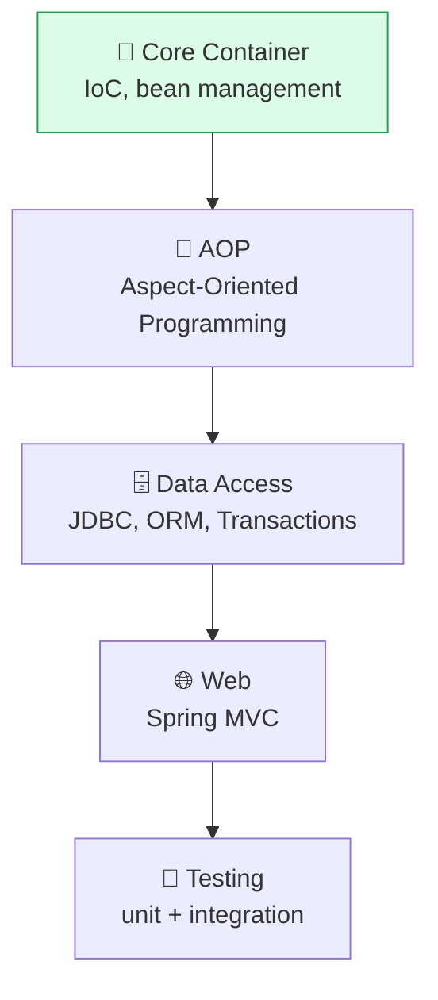

| Module | Purpose |
|---|---|
| **Core Container** | IoC container, bean management (the heart) |
| **AOP** | Aspect-Oriented Programming (cross-cutting concerns: logging, security) |
| **Data Access** | JDBC, ORM, transaction management |
| **Web** | Web layer — Spring MVC |
| **Testing** | Unit / integration test support |

🧠 **Loose coupling in one line:** a class should depend on an **interface**, not on `new SomeConcreteClass()`. Spring hands it the concrete object at runtime — so you can swap implementations without touching the class.

---

## 2️⃣ IoC Container & the Core Idea

### IoC vs DI — what's the difference?

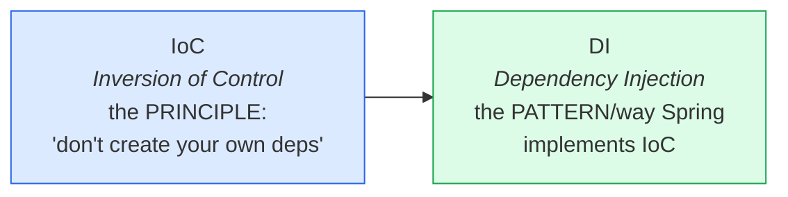

- **IoC (Inversion of Control)** = the *principle*: an object should **not** control the creation of its dependencies; that control is *inverted* and handed to the container.
- **DI (Dependency Injection)** = the *technique* Spring uses to apply IoC — it **injects** dependencies into your beans.

### What the IoC Container does

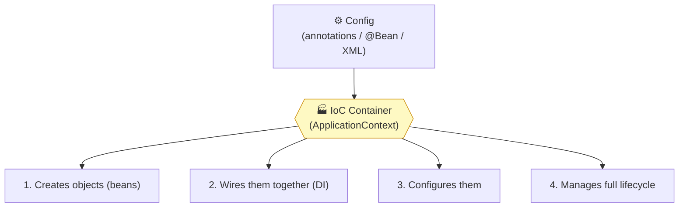

> The container most apps use is the **`ApplicationContext`** (a superset of the older `BeanFactory`). `SpringApplication.run(...)` returns one.

🧠 **Remember:** **C-W-C-M** → **C**reate, **W**ire, **C**onfigure, **M**anage.

---

## 3️⃣ Beans

> A **bean** = an object that is **instantiated, assembled, and managed by the Spring IoC container.** Beans are the building blocks wired together to form the app.

### How to define a bean — two ways

**Way 1 — Stereotype annotations** (Spring scans + auto-registers):
```java
@Component   // generic bean
@Service     // service / business layer
@Repository  // data layer (also translates DB exceptions)
@Controller  // web layer (returns views)
@RestController // web layer for REST (= @Controller + @ResponseBody)
```

**Way 2 — Explicit `@Bean` in a `@Configuration` class** (best for 3rd-party classes you can't annotate):
```java
@Configuration
public class AppConfig {
    @Bean
    public MyService myService() {
        return new MyService();   // YOU build it; Spring manages it
    }
}
```

### Stereotypes are all specializations of @Component

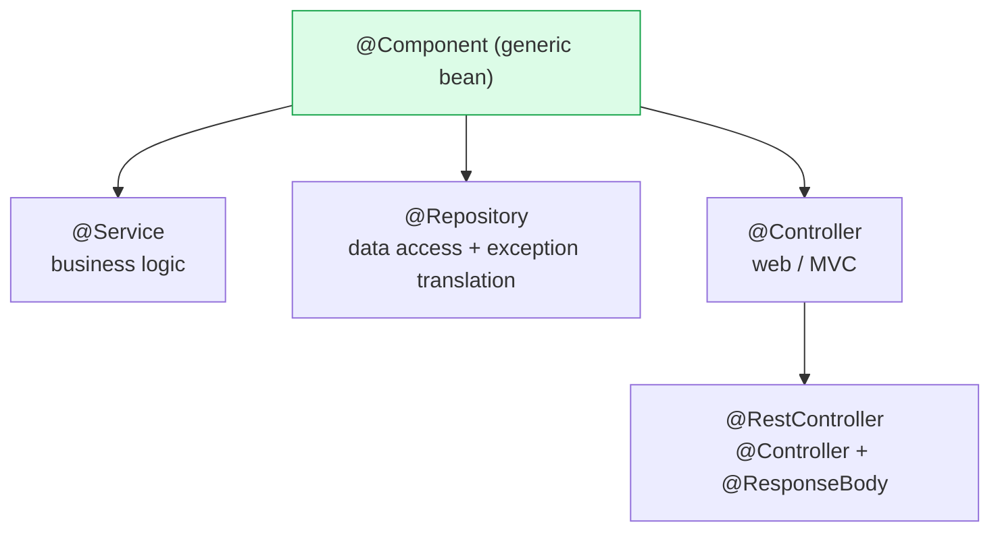

> Functionally `@Service`/`@Repository`/`@Controller` behave like `@Component`, but they document **intent** (and `@Repository` adds DB exception translation). Use the specific one for clarity.

> 📝 **Note:** Spring originally used **XML config**; Java-based **annotation** config came later as the cleaner default.

### Bean Lifecycle

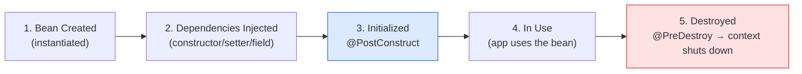

| Stage | What happens |
|---|---|
| Created | instance created (via constructor / factory method) |
| Dependencies injected | constructor / setter / field injection occurs |
| Initialized | `@PostConstruct` method runs |
| In use | application uses the bean |
| Destroyed | `@PreDestroy` runs, then the context closes |

```java
@Component
public class CacheManager {
    @PostConstruct
    void init() { /* runs AFTER construction + DI — warm up cache, open resources */ }

    @PreDestroy
    void cleanup() { /* runs just BEFORE destruction — flush, close connections */ }
}
```

> 🔧 **Fix / Modern (Spring Boot 3):** `@PostConstruct` and `@PreDestroy` now come from **`jakarta.annotation.*`** (not `javax.annotation.*`). They ship with `spring-boot-starter` — no extra dependency needed.

> ⚠️ `@PreDestroy` is **not** called for `prototype`-scoped beans — Spring hands off a prototype and stops tracking it, so it never fires the destroy callback.

### Bean Scopes

| Scope | One instance per… | Context |
|---|---|---|
| **singleton** *(default)* | the whole IoC container | any |
| **prototype** | every request for the bean (`getBean`) | any |
| **request** | one HTTP request | web only |
| **session** | one HTTP session | web only |
| **application** | the `ServletContext` lifecycle | web only |
| **websocket** | one WebSocket session | web only |

> 🔧 **Added:** The original listed only singleton/prototype/request/websocket. The full standard set also includes **`session`** and **`application`**.

🧠 **Singleton vs Prototype:** *singleton* = one shared object for everyone (like one office printer); *prototype* = a fresh object each time you ask (like a new disposable cup).

---

## 4️⃣ Dependency Injection

> **DI** = a component does **not** create its own dependencies; they are **injected** from outside (by Spring).

### Benefits

| Benefit | Why it matters |
|---|---|
| **Loose coupling** | classes depend on interfaces, not concrete `new` calls |
| **Flexible config** | swap implementations without changing the class |
| **Testability** | inject mocks/fakes in unit tests easily |

### The 3 types of DI

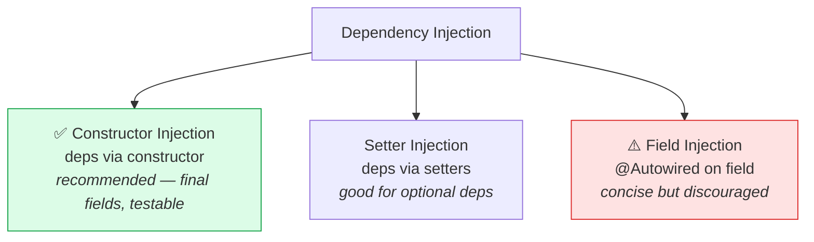

```java
// ✅ 1) CONSTRUCTOR INJECTION (recommended)
@Component
public class CakeBaker {
    private final Frosting frosting;     // can be final → immutable
    private final Syrup syrup;

    public CakeBaker(Frosting frosting, Syrup syrup) {   // @Autowired optional (single ctor)
        this.frosting = frosting;
        this.syrup = syrup;
    }
}

// 2) SETTER INJECTION (good for optional dependencies)
@Component
public class CakeBaker {
    private Frosting frosting;
    @Autowired public void setFrosting(Frosting frosting) { this.frosting = frosting; }
}

// ⚠️ 3) FIELD INJECTION (concise, but discouraged)
@Component
public class CakeBaker {
    @Autowired private Frosting frosting;   // can't be final, hard to test, hidden deps
}
```

> 🔧 **Modern tips**
> - With **one constructor**, `@Autowired` is **optional** (Spring 4.3+). The repo's `CakeBaker` omits it — and it still works.
> - **Field injection is discouraged**: fields can't be `final`, dependencies are hidden, unit testing needs reflection, and you risk `NullPointerException` if used before injection. Prefer **constructor injection**.
> - The original notes listed only 2 types — there are **3** (constructor, setter, field).

### 🍰 The Bakery Analogy (Alice's Bakery)

> Alice's `CakeBaker` bakes a cake. To bake, it needs **Frosting** and **Syrup** — but it never *makes* them. Spring injects them. Switch the cake flavour just by changing the wiring — the baking logic never changes. **That's the power of DI.**

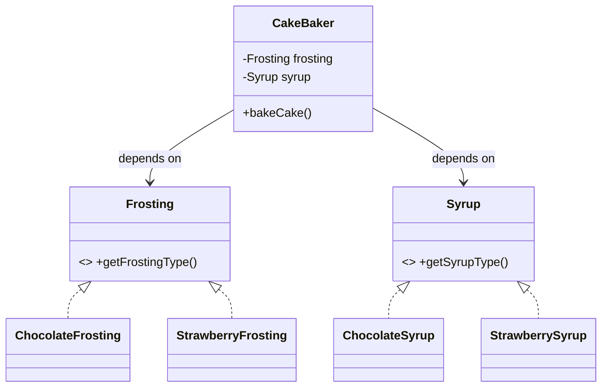

```java
// Interfaces (the contract → enables loose coupling)
public interface Frosting { String getFrostingType(); }
public interface Syrup    { String getSyrupType(); }

// Implementations = Spring beans
@Component
public class ChocolateFrosting implements Frosting {
    public String getFrostingType() { return "Chocolate Frosting"; }
}
@Component
public class StrawberryFrosting implements Frosting {
    public String getFrostingType() { return "Strawberry Frosting"; }
}
// (ChocolateSyrup / StrawberrySyrup are analogous)

@Component
public class CakeBaker {
    private final Frosting frosting;
    private final Syrup syrup;

    // ⬇️ @Qualifier picks WHICH implementation when several match
    public CakeBaker(@Qualifier("chocolateFrosting") Frosting frosting,
                     @Qualifier("chocolateSyrup")    Syrup syrup) {
        this.frosting = frosting;
        this.syrup = syrup;
    }
    public void bakeCake() {
        System.out.println("Cake Baker...");
        System.out.println(frosting.getFrostingType());
        System.out.println(syrup.getSyrupType());
    }
}

@SpringBootApplication
public class Module1HomeworkApplication {
    public static void main(String[] args) {
        ApplicationContext ctx = SpringApplication.run(Module1HomeworkApplication.class, args);
        ctx.getBean(CakeBaker.class).bakeCake();
    }
}
```
**Output:**
```
Cake Baker...
Chocolate Frosting
Chocolate Syrup
```
🔁 **Switch to strawberry** → change only the two `@Qualifier` values to `"strawberryFrosting"` / `"strawberrySyrup"`. `CakeBaker`'s logic stays identical.

### Resolving "which bean?" when multiple implementations exist

```mermaid
flowchart TD
    Q{"2+ beans match the type?"} -->|No| OK["✅ inject directly"]
    Q -->|Yes| R{"How to pick one?"}
    R --> A["@Qualifier(\"beanName\")<br/>name the exact bean"]
    R --> B["@Primary on one bean<br/>default winner"]
    style OK fill:#dcfce7,stroke:#16a34a
```

- **`@Qualifier("name")`** at the injection point → choose a specific bean by name. The bean name defaults to the **decapitalized class name** (`ChocolateFrosting` → `chocolateFrosting`); you can also put `@Qualifier("...")` on the bean class itself.
- **`@Primary`** on one implementation → it becomes the default when no qualifier is given.
- ⚠️ Without either, Spring throws `NoUniqueBeanDefinitionException` (expected 1, found 2).

---

## 5️⃣ Spring Boot vs Spring Framework

> **Spring Boot = Spring Framework + Auto-Configuration + Embedded Server + Starters.** It removes boilerplate so you ship faster.

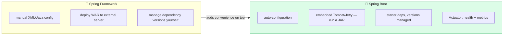

| Feature | Spring Framework | Spring Boot |
|---|---|---|
| Configuration | manual XML / Java | **auto-configuration** |
| Server | deploy to external server | **embedded** Tomcat/Jetty |
| Dependencies | manage manually | **starter** dependencies |
| Boilerplate | more | much less |
| Production features | extra setup | built-in **Actuator**, metrics, health checks |
| Dev speed | slow setup | fast |

### Spring Boot's 5 key features

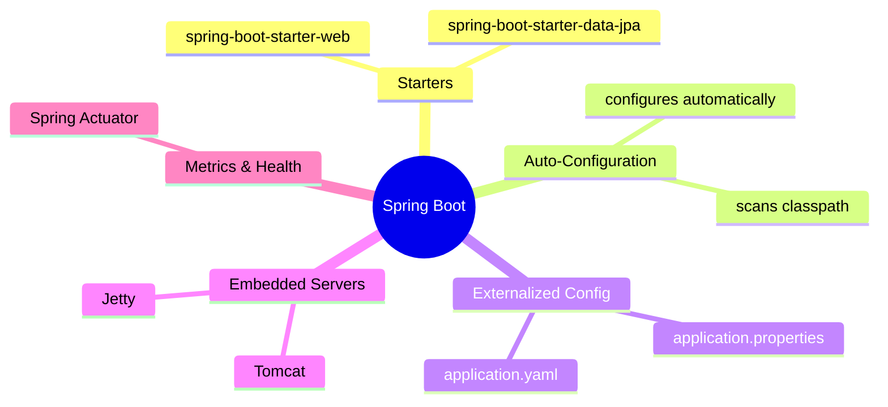

1. **Starter dependencies** — one dependency pulls in everything related (e.g. `spring-boot-starter-web`).
2. **Auto-configuration** — detects classpath and configures sensible defaults.
3. **Externalized configuration** — `application.properties` / `.yaml` / env variables.
4. **Embedded servers** — Tomcat/Jetty bundled; just run the JAR (no WAR deploy).
5. **Built-in metrics & health checks** — Spring **Actuator** (`/actuator/health`, metrics, info).

🧠 **5 features memory hook → "S-A-E-E-M":** **S**tarters, **A**uto-config, **E**xternalized config, **E**mbedded server, **M**etrics (Actuator).

---

## 6️⃣ Auto-Configuration & Internal Startup Flow

### What is auto-configuration?

> **Automatically configuring beans based on what's on the classpath** (+ your settings). Goal: you write **business logic**, not framework plumbing.

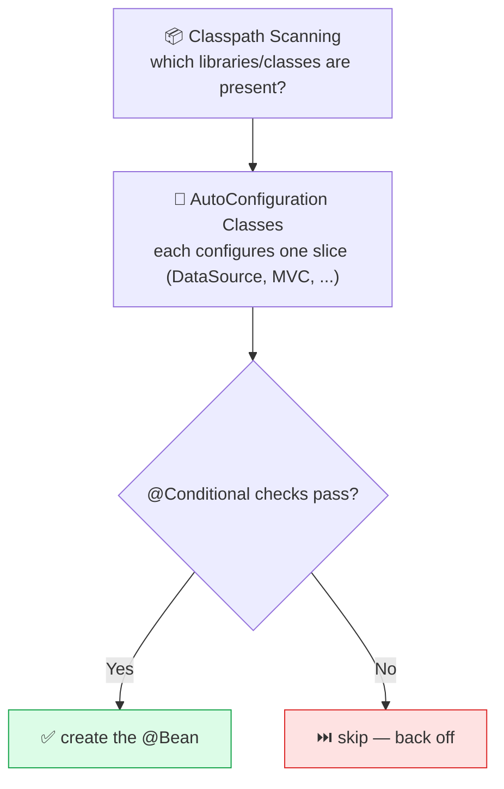

> 💡 **Key insight:** Spring Boot is essentially a big collection of ordinary `@Configuration` classes that create `@Bean`s **only when certain `@Conditional`s are met**.

### Important conditional annotations

```java
@ConditionalOnClass(DataSource.class)      // apply only if class is on the classpath
@ConditionalOnMissingBean(DataSource.class)// apply only if user hasn't defined this bean
@ConditionalOnBean(DataSource.class)       // apply only if a given bean already exists
@ConditionalOnProperty("my.feature.enabled")// apply only if property is set/true
```

> 🔧 **Added:** `@ConditionalOnMissingBean` is the one that makes Boot **back off** when you define your own bean — that's *why* your custom `@Bean` always overrides Boot's default. Worth knowing for interviews.

### `@SpringBootApplication` decoded

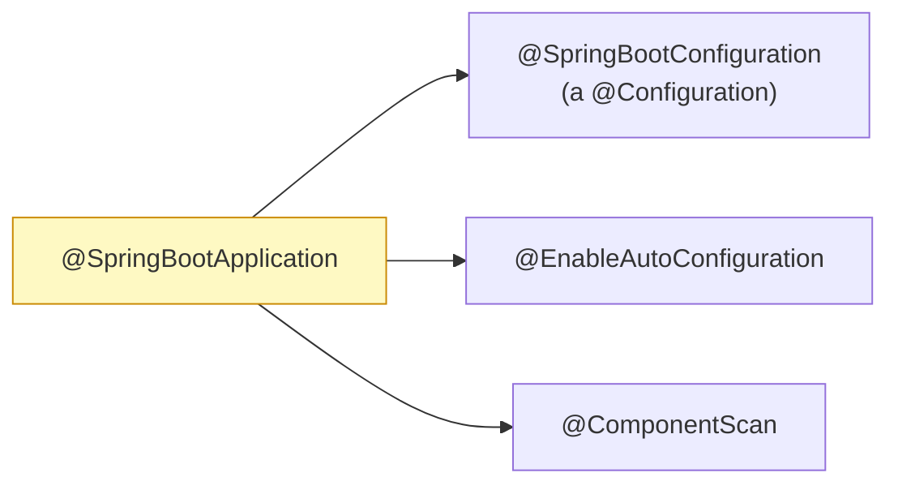

> 🔧 **Precise version:** `@SpringBootApplication` = **`@SpringBootConfiguration`** (which is itself `@Configuration`) + `@EnableAutoConfiguration` + `@ComponentScan`. The original wrote `@Configuration` directly — the actual meta-annotation is `@SpringBootConfiguration`.

### Role of `pom.xml`

- **Maven** resolves + downloads dependencies.
- `spring-boot-starter-parent` provides sensible build defaults and imports `spring-boot-dependencies`.
- `spring-boot-dependencies` is a **BOM** (Bill of Materials) that pins versions of tons of libraries → **you usually don't specify versions yourself.**

### Internal startup flow (step by step)

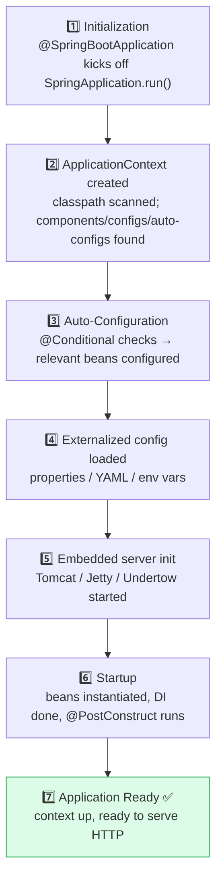

---

## 7️⃣ Maven

> **Maven = build automation + project management tool** for Java. `pom.xml` is its recipe book.

🍳 **Chef analogy:** Maven "cooks" your project — fetches ingredients (dependencies), compiles, tests, and packages the dish (JAR/WAR).

### Build lifecycle (each phase runs the ones before it)

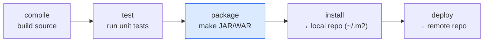

### Commands

| Command | Purpose |
|---|---|
| `mvn clean` | delete previous build output (`target/`) |
| `mvn compile` | compile source code |
| `mvn test` | run tests |
| `mvn package` | build a JAR/WAR |
| `mvn install` | install artifact to the local repo (`~/.m2`) |
| `mvn deploy` | publish to a remote repo |
| `mvn spring-boot:run` | run the app straight from source (no packaging) |
| `mvn spring-boot:build-image` | build a Docker/OCI image |

> 🧠 `clean` + a phase is the everyday combo, e.g. `mvn clean package` → wipe, then rebuild the JAR fresh.

---

## 8️⃣ Annotations Reference

| Annotation | Purpose | Package (Boot 3) |
|---|---|---|
| `@SpringBootApplication` | main class = `@SpringBootConfiguration` + `@EnableAutoConfiguration` + `@ComponentScan` | `org.springframework...` |
| `@Component` | mark a class as a Spring bean | spring |
| `@Service` / `@Repository` / `@Controller` / `@RestController` | specialized stereotypes of `@Component` | spring |
| `@Autowired` | inject a dependency (ctor / setter / field) | spring |
| `@Qualifier("name")` | pick a specific bean when several match | spring |
| `@Primary` | mark the default bean among several | spring |
| `@Configuration` | mark a class as a config class | spring |
| `@Bean` | declare a bean explicitly inside a config class | spring |
| `@PostConstruct` | run after bean init | **`jakarta.annotation`** 🔧 |
| `@PreDestroy` | run before bean destroy | **`jakarta.annotation`** 🔧 |
| `@ConditionalOnClass` | auto-config: apply if class on classpath | spring boot |
| `@ConditionalOnBean` | auto-config: apply if a bean exists | spring boot |
| `@ConditionalOnMissingBean` | auto-config: apply if a bean is *absent* (back-off) | spring boot |
| `@ConditionalOnProperty` | auto-config: apply if a property is set | spring boot |

---

## 9️⃣ Self-Test Q&A

> Read the question, answer in your head, then expand. (From the module homework + common interview questions.)

### 🟢 Core concepts

<details><summary><b>Q1.</b> What is the Spring Framework in one line?</summary>

A Dependency Injection framework that makes Java apps loosely coupled by building them from POJOs and wiring/managing those objects for you.
</details>

<details><summary><b>Q2.</b> IoC vs DI?</summary>

IoC is the *principle* (don't create your own dependencies — control is inverted to the container). DI is the *technique/pattern* Spring uses to apply IoC by injecting dependencies into beans.
</details>

<details><summary><b>Q3.</b> What does the IoC container do?</summary>

Creates beans, wires them together, configures them, and manages their full lifecycle (C-W-C-M). The common implementation is `ApplicationContext`.
</details>

<details><summary><b>Q4.</b> What is a bean?</summary>

An object instantiated, assembled, and managed by the Spring IoC container — the building block of a Spring app.
</details>

<details><summary><b>Q5.</b> Two ways to define a bean?</summary>

(1) Stereotype annotations (`@Component`/`@Service`/`@Repository`/`@Controller`) auto-scanned, or (2) an explicit `@Bean` method inside a `@Configuration` class (best for 3rd-party classes you can't annotate).
</details>

<details><summary><b>Q6.</b> Difference between @Component, @Service, @Repository, @Controller?</summary>

All are beans; `@Service`/`@Repository`/`@Controller` are *specializations* of `@Component` that document intent. `@Repository` also adds DB exception translation; `@Controller`/`@RestController` mark the web layer.
</details>

<details><summary><b>Q7.</b> Bean lifecycle stages?</summary>

Created → dependencies injected → initialized (`@PostConstruct`) → in use → destroyed (`@PreDestroy`).
</details>

<details><summary><b>Q8.</b> @PostConstruct vs @PreDestroy?</summary>

`@PostConstruct` runs once after construction + DI (init/warm-up). `@PreDestroy` runs just before the bean is destroyed (cleanup). In Boot 3 they live in `jakarta.annotation.*`.
</details>

<details><summary><b>Q9.</b> Bean scopes?</summary>

singleton (default, one per container), prototype (new each request), and web scopes: request, session, application, websocket.
</details>

<details><summary><b>Q10.</b> singleton vs prototype?</summary>

singleton = one shared instance per container. prototype = a brand-new instance every time the bean is requested. (Note: `@PreDestroy` doesn't fire for prototypes.)
</details>

### 🟡 Dependency Injection

<details><summary><b>Q11.</b> What is DI and why use it?</summary>

A pattern where dependencies are injected from outside instead of created internally — giving loose coupling, flexible/swappable config, and easy testability (mocking).
</details>

<details><summary><b>Q12.</b> Three types of DI? Which is best?</summary>

Constructor (✅ recommended — allows `final` fields, clear deps, testable), setter (good for optional deps), and field (concise but discouraged). 
</details>

<details><summary><b>Q13.</b> Why avoid field injection?</summary>

Fields can't be `final`, dependencies are hidden, testing needs reflection, and there's NPE risk if accessed before injection.
</details>

<details><summary><b>Q14.</b> Is @Autowired always required on a constructor?</summary>

No — if a class has a single constructor, `@Autowired` is optional (Spring 4.3+).
</details>

<details><summary><b>Q15.</b> Two beans match one type — how does Spring pick?</summary>

Use `@Qualifier("beanName")` at the injection point, or mark one bean `@Primary`. Otherwise Spring throws `NoUniqueBeanDefinitionException`.
</details>

<details><summary><b>Q16.</b> What's the default bean name for ChocolateFrosting?</summary>

The decapitalized class name → `chocolateFrosting`.
</details>

<details><summary><b>Q17.</b> In the bakery example, how do you switch from chocolate to strawberry cake?</summary>

Change only the two `@Qualifier` values in `CakeBaker` to `"strawberryFrosting"` / `"strawberrySyrup"`. The baking logic doesn't change — that's the power of DI.
</details>

### 🔵 Spring Boot / Auto-config / Maven

<details><summary><b>Q18.</b> Spring Boot vs Spring Framework — biggest wins?</summary>

Auto-configuration, embedded server (run a JAR, no WAR), starter dependencies with managed versions, and built-in production features (Actuator). Net effect: far less boilerplate, faster development.
</details>

<details><summary><b>Q19.</b> Spring Boot's 5 key features?</summary>

Starters, auto-configuration, externalized configuration, embedded servers, and metrics/health checks (Actuator). Hook: **S-A-E-E-M**.
</details>

<details><summary><b>Q20.</b> What does @SpringBootApplication combine?</summary>

`@SpringBootConfiguration` (a `@Configuration`) + `@EnableAutoConfiguration` + `@ComponentScan`.
</details>

<details><summary><b>Q21.</b> How does auto-configuration work?</summary>

Boot scans the classpath, and many `@Configuration` classes create `@Bean`s only when `@Conditional` checks pass (e.g. `@ConditionalOnClass`, `@ConditionalOnMissingBean`).
</details>

<details><summary><b>Q22.</b> Why does my custom @Bean override Spring Boot's default?</summary>

Boot's auto-config beans are guarded by `@ConditionalOnMissingBean` — when you define your own, Boot "backs off" and doesn't create its default.
</details>

<details><summary><b>Q23.</b> Role of spring-boot-dependencies / starter-parent?</summary>

A BOM that pins versions of many libraries so you usually don't declare versions; `starter-parent` adds sensible build defaults and imports that BOM.
</details>

<details><summary><b>Q24.</b> When is Spring (Java) preferred over Node.js?</summary>

Large enterprise systems needing scalability/security/maintainability, strong compile-time type safety, real multithreading for CPU-bound work, and a mature ecosystem (Security, Transactions, MVC, Cloud).
</details>

<details><summary><b>Q25.</b> Common Maven commands?</summary>

`clean`, `compile`, `test`, `package`, `install`, `deploy`, plus `spring-boot:run` (run from source) and `spring-boot:build-image` (Docker image). Everyday combo: `mvn clean package`.
</details>

---

## 🔟 Cheat Sheet + Corrections Log

```
SPRING IN ONE BREATH
  Spring        = DI framework → loose coupling via POJOs
  IoC           = principle (don't create your own deps)
  DI            = the pattern that implements IoC (injection)
  IoC Container = ApplicationContext → Create, Wire, Configure, Manage (C-W-C-M)

BEANS
  Define: @Component family  OR  @Bean in @Configuration
  Stereotypes: @Component → @Service / @Repository / @Controller → @RestController
  Lifecycle: created → DI → @PostConstruct → used → @PreDestroy
  Scopes: singleton(default), prototype, request, session, application, websocket

DEPENDENCY INJECTION
  Constructor ✅ (final fields, testable)  ·  Setter (optional)  ·  Field ⚠️ (avoid)
  Single constructor → @Autowired optional
  Multiple matches → @Qualifier("name") or @Primary

SPRING BOOT = Spring + Auto-config + Embedded server + Starters
  5 features (S-A-E-E-M): Starters, Auto-config, Externalized config, Embedded server, Metrics(Actuator)
  @SpringBootApplication = @SpringBootConfiguration + @EnableAutoConfiguration + @ComponentScan
  Auto-config = @Configuration classes + @Conditional (esp. @ConditionalOnMissingBean → back-off)

MAVEN (chef 🍳)
  clean → compile → test → package → install → deploy
  mvn clean package · mvn spring-boot:run
```

### 🔧 Corrections & additions (vs the original notes)

| # | Original | This version |
|---|---|---|
| 1 | "Spring developed by Rod Johnson in 2003" | Idea from his **2002** book; framework **1.0 released 2004** |
| 2 | DI had **2 types** (constructor, field) | **3 types** — added **setter injection** |
| 3 | (not stated) | Field injection is **discouraged**; `@Autowired` optional with a single constructor |
| 4 | Scopes: singleton/prototype/request/websocket | Added **session** and **application** (full standard set) |
| 5 | `@SpringBootApplication = @Configuration + ...` | Precise: **`@SpringBootConfiguration`** + `@EnableAutoConfiguration` + `@ComponentScan` |
| 6 | Conditionals listed 3 | Added **`@ConditionalOnMissingBean`** (the "back-off" mechanism) |
| 7 | `@PostConstruct`/`@PreDestroy` (no package) | Boot 3: **`jakarta.annotation.*`** |
| 8 | (not stated) | Added **`@Primary`**, stereotype hierarchy, prototype + `@PreDestroy` caveat |

---

> **Revision flow:** §1 → §2 (IoC vs DI) → §3 (beans + lifecycle) → §4 (DI + bakery) → §5/§6 (Boot + auto-config — interview favourites) → drill §9 with answers hidden. 🌱→🚀
