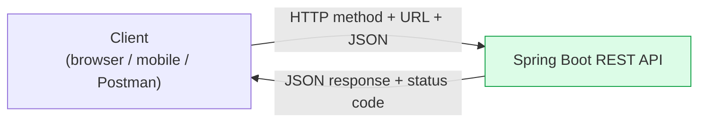
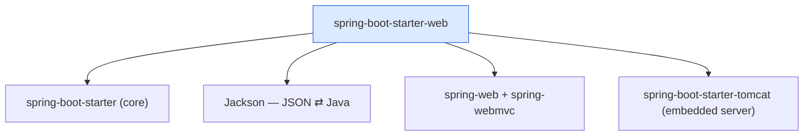
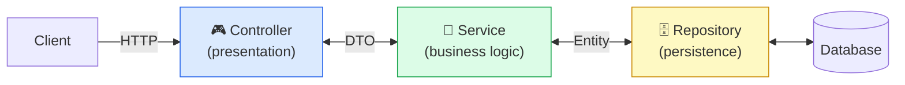
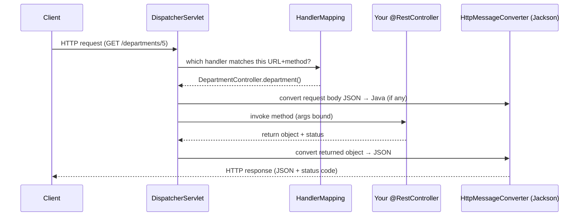
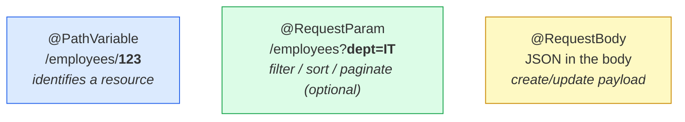
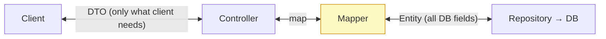
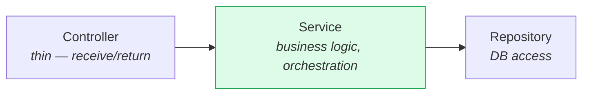
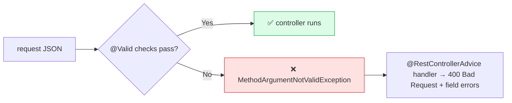
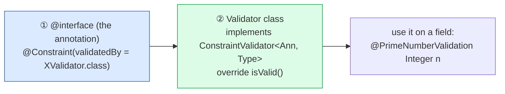
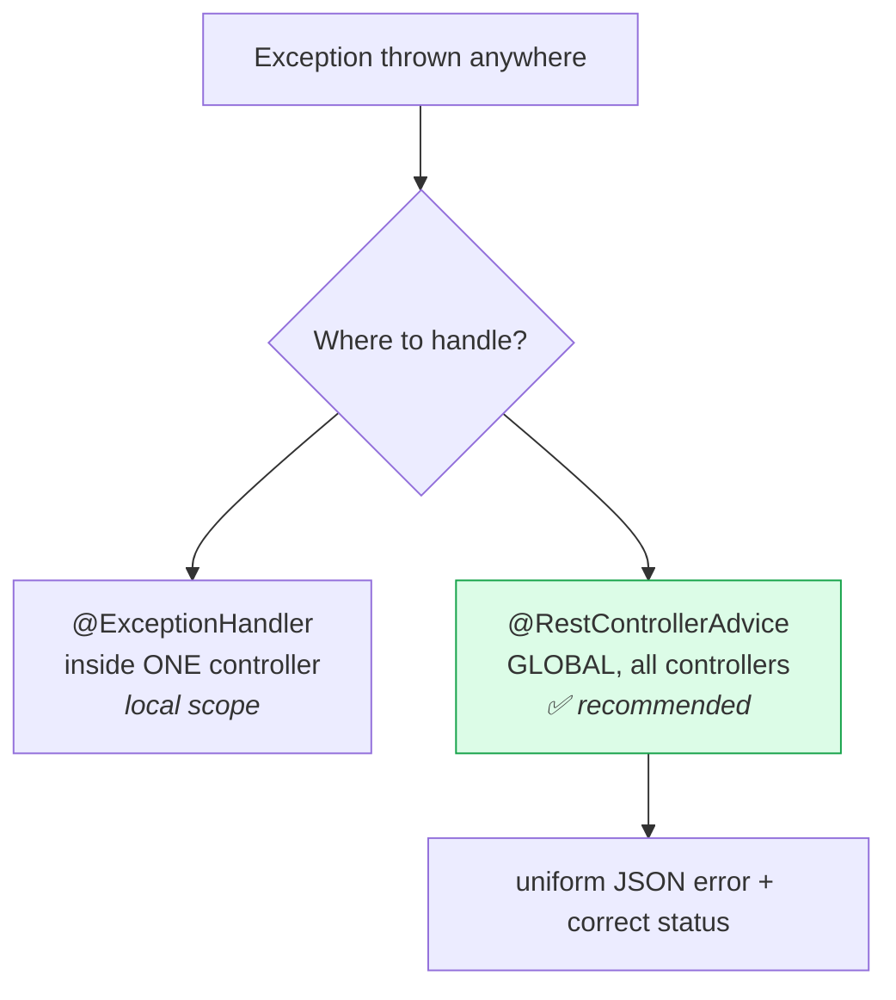

# 🌐 Module 2 — Spring Boot Web MVC & RESTful APIs: Complete Revision Notes

> **One file. Visual-first. Built to learn fast + remember + crack interviews.**
> Same style as the Module 1 & JPA notes: Mermaid diagrams + clean tables + collapsible self-test + 🔧 *modern/fix* (Spring Boot 3 / `jakarta.*`) callouts.

---

## 🧭 How to use these notes

| Symbol | Meaning |
|:---:|---|
| 🔧 **Fix / Modern** | A correction or a Spring Boot 3 / `jakarta` update vs the original notes |
| ✅ / ❌ | Do this / avoid this |
| ⚠️ | Common trap |
| 🧠 | Memory trick |
| 🏆 | Cheat sheet |

Interview prep? Jump to [§13 Self-Test Q&A](#13--self-test-qa) — answers are **collapsed** so you can quiz yourself.

---

## 📚 Table of Contents

1. [The Big Picture — REST + Layered MVC](#1--the-big-picture--rest--layered-mvc)
2. [Spring MVC Request Lifecycle (DispatcherServlet)](#2--spring-mvc-request-lifecycle)
3. [Controllers & Request Mapping](#3--controllers--request-mapping)
4. [Getting Data IN — @PathVariable / @RequestParam / @RequestBody](#4--getting-data-in)
5. [HTTP Methods, Status Codes & Idempotency](#5--http-methods-status-codes--idempotency)
6. [Persistence Layer — Entity, DTO, JpaRepository, H2](#6--persistence-layer)
7. [Service Layer](#7--service-layer)
8. [Input Validation (built-in + custom)](#8--input-validation)
9. [Exception Handling](#9--exception-handling)
10. [Consistent API Response Wrapper](#10--consistent-api-response-wrapper)
11. [Lombok](#11--lombok)
12. [Annotations Reference](#12--annotations-reference)
13. [Self-Test Q&A](#13--self-test-qa)
14. [Cheat Sheet + Corrections Log](#14--cheat-sheet--corrections-log)

---

## 1️⃣ The Big Picture — REST + Layered MVC

### What is a REST API?

> **REST (Representational State Transfer)** = a set of conventions for web services. It's **resource-based**: every URL is a *resource*, and the **HTTP method** decides the *action* on it.



### Standard REST endpoint pattern

| HTTP Method | URL | Action |
|---|---|---|
| `GET` | `/users` | get all users |
| `GET` | `/users/{id}` | get one user |
| `POST` | `/users` | create a user |
| `PUT` | `/users/{id}` | full update |
| `PATCH` | `/users/{id}` | partial update |
| `DELETE` | `/users/{id}` | delete a user |

🧠 **Resource is a noun, method is the verb.** URL = *what* (`/users/5`), method = *do what* (GET/POST/…). Avoid verbs in URLs (`/getUser` ❌).

### `spring-boot-starter-web` — one dependency, everything for REST

```xml
<dependency>
    <groupId>org.springframework.boot</groupId>
    <artifactId>spring-boot-starter-web</artifactId>
</dependency>
```



### Layered (MVC) architecture



> **DTO** crosses the Controller↔Service boundary (what the client sees). **Entity** lives in the Service↔Repository↔DB boundary (what gets stored). Keep them separate.

| Benefit | Meaning |
|---|---|
| **Separation of concerns** | each layer has one job |
| **Reusability** | service/repository reused across controllers |
| **Testability** | each layer unit-tested in isolation |
| **Scalability** | layers replaced/scaled independently |

🧠 **Layer order memory:** **C-S-R-D** → **C**ontroller → **S**ervice → **R**epository → **D**atabase. Controllers should be *thin*; brains live in the service.

---

## 2️⃣ Spring MVC Request Lifecycle

> 🔧 **Added (not in the original, but key for understanding + interviews):** how a request actually flows inside Spring MVC. The **DispatcherServlet** is the front controller that routes everything.



1. **DispatcherServlet** receives every request (the "front controller").
2. **HandlerMapping** finds the controller method matching the URL + HTTP method.
3. **HttpMessageConverter** (Jackson) converts request JSON → Java (`@RequestBody`) and the return value → JSON.
4. The controller runs, returns an object; Spring serializes it back to the client.

> ✅ With `@RestController`, you return plain objects — Jackson turns them into JSON automatically. No view resolver involved.

---

## 3️⃣ Controllers & Request Mapping

### @Controller vs @RestController

| Annotation | Returns | Use for |
|---|---|---|
| `@Controller` | a **View** (HTML via template engine) | server-rendered pages |
| `@RestController` | **JSON/XML** directly (= `@Controller` + `@ResponseBody`) | **REST APIs** ✅ |

```java
@RestController
@RequestMapping("/departments")          // base path for the whole class
public class DepartmentController {

    @GetMapping                          // GET /departments
    public List<DepartmentDTO> getAll() { ... }

    @GetMapping("/{id}")                 // GET /departments/5
    public DepartmentDTO getOne(@PathVariable Long id) { ... }

    @PostMapping                         // POST /departments
    public DepartmentDTO create(@Valid @RequestBody DepartmentDTO dto) { ... }
}
```

### Mapping annotations

```java
@RequestMapping(value="/users", method=RequestMethod.GET)  // generic (any method)
@GetMapping("/users")        // GET   — read
@PostMapping("/users")       // POST  — create
@PutMapping("/users/{id}")   // PUT   — full update
@PatchMapping("/users/{id}") // PATCH — partial update
@DeleteMapping("/users/{id}")// DELETE— remove
```

`@GetMapping` etc. are just shortcuts for `@RequestMapping(method = ...)`. Put the common base path in a class-level `@RequestMapping`.

---

## 4️⃣ Getting Data IN

Three ways the client sends data to your controller:



```java
// @PathVariable — value is part of the URL path → use to IDENTIFY a resource
@GetMapping("/employees/{id}")
public Employee get(@PathVariable Long id) { ... }          // /employees/123

// @RequestParam — value from the query string → use for OPTIONAL filters
@GetMapping("/employees")
public List<Employee> list(
    @RequestParam(required=false) String department,        // /employees?department=IT
    @RequestParam(defaultValue="0") int page) { ... }

// @RequestBody — maps JSON body → Java object (via Jackson) → POST/PUT/PATCH
@PostMapping("/users")
public ResponseEntity<User> create(@RequestBody User user) { ... }
```

| | `@PathVariable` | `@RequestParam` |
|---|---|---|
| Comes from | URL **path** | URL **query string** |
| Example | `/users/5` | `/users?active=true` |
| Use for | identifying a resource | filtering / sorting / pagination |
| Optional? | usually required | often optional (`required=false`, `defaultValue`) |

🧠 **Path = identity, Param = options.** If removing it points to a *different thing* → path variable. If it just *narrows/filters* → request param.

---

## 5️⃣ HTTP Methods, Status Codes & Idempotency

### CRUD ↔ HTTP method ↔ body

| Method | Purpose | Body | Idempotent? | Typical success status |
|---|---|---|---|---|
| `GET` | read | none | ✅ | **200 OK** |
| `POST` | create | full | ❌ | **201 Created** |
| `PUT` | full replace | full object | ✅ | **200 OK** / 204 |
| `PATCH` | partial update | changed fields | ⚠️ usually no | **200 OK** |
| `DELETE` | remove | none | ✅ | **204 No Content** / 200 |

> 🔧 **Added — idempotency (interview favourite):** *idempotent* = calling it many times has the same effect as once. **GET, PUT, DELETE are idempotent; POST is not** (two POSTs = two resources). PATCH is generally not guaranteed idempotent.

### Common status codes to actually return

| Code | Meaning | When |
|---|---|---|
| **200 OK** | success | GET/PUT/PATCH succeeded |
| **201 Created** | resource created | POST succeeded |
| **204 No Content** | success, nothing to return | DELETE succeeded |
| **400 Bad Request** | client sent bad data | validation failed |
| **404 Not Found** | resource doesn't exist | id not found |
| **500 Internal Server Error** | unhandled server error | bug / unexpected |

> ⚠️ **Fix (real bug in the module code):** the homework `DepartmentController` returns `HttpStatus.FOUND` (**302**) for `GET /departments`. **302 is a redirect**, not "resource found" — a successful GET should return **200 OK**. Don't confuse the English word "found" with HTTP 302.

```java
// ✅ Correct status usage
@GetMapping("/{id}")
public ResponseEntity<DepartmentDTO> get(@PathVariable Long id) {
    return ResponseEntity.ok(service.get(id));               // 200
}
@PostMapping
public ResponseEntity<DepartmentDTO> create(@Valid @RequestBody DepartmentDTO dto) {
    return ResponseEntity.status(HttpStatus.CREATED).body(service.create(dto)); // 201
}
@DeleteMapping("/{id}")
public ResponseEntity<Void> delete(@PathVariable Long id) {
    service.delete(id);
    return ResponseEntity.noContent().build();               // 204
}
```

> **`ResponseEntity<T>`** lets you control body **and** status code. Prefer it over returning raw objects when status matters.

---

## 6️⃣ Persistence Layer

### DTO vs Entity (keep them separate!)



| | **Entity** | **DTO (Data Transfer Object)** |
|---|---|---|
| Purpose | maps to a DB table | carries data between layers |
| Used in | repository layer | controller / service layer |
| Annotation | `@Entity` | plain POJO |
| Exposes | all DB fields | only what the client needs |

> ✅ **Why separate?** Hiding DB internals, avoiding over-exposing fields (e.g. passwords), preventing accidental lazy-loading serialization, and letting the API contract evolve independently from the schema.
> 🔧 **Modern:** map DTO↔Entity with **MapStruct** (compile-time, fast) — the module includes a `DepartmentMapper`. Avoid hand-writing large mappers.

### `@Entity`

```java
@Entity
public class Department {
    @Id
    @GeneratedValue(strategy = GenerationType.IDENTITY)
    private Long id;
    private String title;
    private Boolean isActive;
    private LocalDateTime createdAt;   // 🔧 prefer java.time over java.util.Date
}
```
- Class-level annotation; class name → table name (configurable with `@Table`).
- Must have a `@Id` primary key; `@GeneratedValue` auto-generates it.

> 🔧 The original `Department` used `java.util.Date createdAt`. Prefer `LocalDateTime`/`Instant` (no `@Temporal` needed). *(Full JPA depth is covered in Module 3.)*

### `JpaRepository` — CRUD for free

```java
public interface DepartmentRepository extends JpaRepository<Department, Long> {
    // inherited: findAll(), findById(), save(), deleteById(), count(), existsById()...
    // add custom finders: List<Department> findByIsActiveTrue();
}
```
- Generic: `JpaRepository<EntityType, IdType>`.
- Full CRUD with **zero implementation**; add derived methods or `@Query` for custom needs.

### H2 — in-memory DB for dev/testing

```xml
<dependency>
    <groupId>com.h2database</groupId>
    <artifactId>h2</artifactId>
    <scope>runtime</scope>
</dependency>
```
Console at `http://localhost:8080/h2-console` — great for development without a real DB.

---

## 7️⃣ Service Layer

> The service layer is the **brain** 🧠 — it sits between controller and repository and holds **business logic** (validations, calculations, rules), keeping controllers thin.



```java
@Service
public class DepartmentService {
    private final DepartmentRepository repository;

    public DepartmentService(DepartmentRepository repository) {  // constructor injection ✅
        this.repository = repository;
    }

    public Department getDepartment(Long id) {
        return repository.findById(id)
            .orElseThrow(() -> new ResourceNotFoundException("Department not found: " + id));
    }
}
```

| Benefit | Meaning |
|---|---|
| Modularity | logic lives in one place |
| Maintainability | change rules without touching controllers |
| Scalability | service can later become a microservice |

---

## 8️⃣ Input Validation

Add the starter, then put `@Valid` on the `@RequestBody`:

```xml
<dependency>
    <groupId>org.springframework.boot</groupId>
    <artifactId>spring-boot-starter-validation</artifactId>
</dependency>
```
```java
@PostMapping
public ResponseEntity<?> create(@Valid @RequestBody DepartmentDTO dto) { ... }
//                              ↑ triggers validation; on failure → MethodArgumentNotValidException (400)
```



### Built-in constraint annotations

> 🔧 **Package split (Boot 3):** core ones live in **`jakarta.validation.constraints.*`**; the extras marked *(Hibernate)* live in **`org.hibernate.validator.constraints.*`**.

| Group | Annotations |
|---|---|
| **Null/empty** | `@Null`, `@NotNull`, `@NotEmpty` (size>0), `@NotBlank` (trimmed length>0, strings) |
| **Boolean** | `@AssertTrue`, `@AssertFalse` |
| **Number** | `@Min`, `@Max`, `@DecimalMin`, `@DecimalMax`, `@Positive`, `@PositiveOrZero`, `@Negative`, `@NegativeOrZero`, `@Digits(integer,fraction)`, `@Range(min,max)` *(Hib)* |
| **String** | `@Size(min,max)`, `@Length(min,max)` *(Hib)*, `@Pattern(regexp)`, `@Email`, `@URL` *(Hib)*, `@CreditCardNumber` *(Hib)* |
| **Date** | `@Past`, `@PastOrPresent`, `@Future`, `@FutureOrPresent` |
| **Nested** | `@Valid` (validate a nested object recursively) |

> ⚠️ **Fix (real bug in the module's DTO):** the `id` field is `String` but carries `@Min(5) @Max(10)`. `@Min`/`@Max` are **number-only** — on a `String` they throw `UnexpectedTypeException: No validator could be found for 'jakarta.validation.constraints.Min' validating type 'java.lang.String'`. For string length use **`@Size`** / **`@Length`**, not `@Min`/`@Max`.

> 🧠 **`@NotNull` vs `@NotEmpty` vs `@NotBlank`:** `NotNull` = not null (but `""` ok) · `NotEmpty` = not null **and** size>0 · `NotBlank` = not null **and** non-whitespace text (strings only). Strictness: `NotNull` < `NotEmpty` < `NotBlank`.

### Custom validation — 2 steps

> When built-ins aren't enough, create your own constraint. The module builds two: **@PrimeNumberValidation** and **@PasswordValidation**.



**Step 1 — the annotation:**
```java
@Target({ElementType.METHOD, ElementType.FIELD})
@Retention(RetentionPolicy.RUNTIME)
@Constraint(validatedBy = {PrimeNumberValidator.class})
public @interface PrimeNumberValidation {
    String message() default "Number should be a Prime Number!!";
    Class<?>[] groups() default {};
    Class<? extends Payload>[] payload() default {};
}
```

**Step 2 — the validator:**
```java
public class PrimeNumberValidator implements ConstraintValidator<PrimeNumberValidation, Integer> {
    @Override
    public boolean isValid(Integer number, ConstraintValidatorContext ctx) {
        if (number == null || number < 2) return false;
        if (number == 2 || number == 3)   return true;
        if (number % 2 == 0)              return false;
        for (int i = 5; i * i <= number; i += 6) {       // 6k±1 optimization
            if (number % i == 0 || number % (i + 2) == 0) return false;
        }
        return true;
    }
}
```

**Password example** (regex-based): "at least one uppercase, one lowercase, one special char, min 10 chars":
```java
// inside PasswordValidator.isValid(...)
return value != null &&
       value.matches("^(?=.*[a-z])(?=.*[A-Z])(?=.*[^A-Za-z0-9]).{10,}$");
```
| Regex piece | Meaning |
|---|---|
| `(?=.*[a-z])` | at least one lowercase |
| `(?=.*[A-Z])` | at least one uppercase |
| `(?=.*[^A-Za-z0-9])` | at least one special character |
| `.{10,}` | at least 10 characters total |

Usage on the DTO:
```java
@PrimeNumberValidation private Integer primeNumber;
@PasswordValidation    private String  password;
```

> 🔧 The three members `message()`, `groups()`, `payload()` are **mandatory** in every constraint annotation — the Bean Validation spec requires them.

---

## 9️⃣ Exception Handling

> **Goal:** no crashes, no raw stack traces to clients, **consistent** error responses everywhere.

### Two ways



**Option 1 — local `@ExceptionHandler`** (one controller only):
```java
@ExceptionHandler(ResourceNotFoundException.class)
public ResponseEntity<?> handleNotFound(ResourceNotFoundException ex) {
    return ResponseEntity.status(HttpStatus.NOT_FOUND).body(ex.getMessage());
}
```

**Option 2 — global `@RestControllerAdvice`** ✅ (handles all controllers in one place):
```java
@RestControllerAdvice
public class GlobalExceptionHandler {

    @ExceptionHandler(ResourceNotFoundException.class)
    public ResponseEntity<ApiResponse<?>> handleNotFound(ResourceNotFoundException ex) {
        ApiError error = ApiError.builder()
            .message(ex.getMessage())
            .status(HttpStatus.NOT_FOUND)
            .build();
        return buildErrorResponse(error);
    }

    @ExceptionHandler(MethodArgumentNotValidException.class)   // validation failures → 400
    public ResponseEntity<ApiResponse<?>> handleValidation(MethodArgumentNotValidException ex) {
        Map<String, List<String>> fieldErrors = ex.getBindingResult().getFieldErrors().stream()
            .collect(Collectors.groupingBy(
                FieldError::getField,
                Collectors.mapping(FieldError::getDefaultMessage, Collectors.toList())));
        ApiError error = ApiError.builder()
            .status(HttpStatus.BAD_REQUEST)
            .message("Input validation failed")
            .subErrors(fieldErrors)
            .build();
        return buildErrorResponse(error);
    }

    @ExceptionHandler(Exception.class)                         // catch-all → 500
    public ResponseEntity<ApiResponse<?>> handleGeneral(Exception ex) {
        ApiError error = ApiError.builder()
            .message(ex.getMessage())
            .status(HttpStatus.INTERNAL_SERVER_ERROR)
            .build();
        return buildErrorResponse(error);
    }

    private ResponseEntity<ApiResponse<?>> buildErrorResponse(ApiError e) {
        return new ResponseEntity<>(new ApiResponse<>(e), e.getStatus());
    }
}
```

**Custom exception:**
```java
public class ResourceNotFoundException extends RuntimeException {
    public ResourceNotFoundException(String message) { super(message); }
}
```

> 🔧 **Order matters:** Spring picks the **most specific** matching `@ExceptionHandler`. Keep the broad `Exception.class` handler as the last-resort catch-all so specific ones (NotFound, Validation) win.
> 🔧 **Alternative:** `@ResponseStatus(HttpStatus.NOT_FOUND)` on the exception class itself sets the status without a handler — handy for simple cases. For full control + a consistent body, use `@RestControllerAdvice`.

---

## 🔟 Consistent API Response Wrapper

> Instead of returning raw data *or* raw errors, wrap **every** response in one shape — so clients always parse the same structure.

```json
{
  "data": { "id": 5, "title": "IT" },
  "error": null,
  "timeStamp": "10:30:00 31-05-2026"
}
```
On error:
```json
{
  "data": null,
  "error": { "status": "NOT_FOUND", "message": "Department not found: 5" },
  "timeStamp": "10:30:05 31-05-2026"
}
```

```java
@Getter @Setter @NoArgsConstructor
public class ApiResponse<T> {
    private T data;
    private ApiError error;
    @JsonFormat(pattern = "hh:mm:ss dd-MM-yyyy")
    private LocalDateTime timeStamp = LocalDateTime.now();

    public ApiResponse(T data)      { this(); this.data = data; }
    public ApiResponse(ApiError e)  { this(); this.error = e; }
}
```

- Either `data` **or** `error` is populated (never both meaningfully).
- A global `@RestControllerAdvice` (or `ResponseBodyAdvice<Object>`) can apply the wrapper everywhere automatically.

🧠 **One envelope for all:** success and failure share the same outer shape (`data` / `error` / `timeStamp`). Front-end never has to guess the format.

---

## 1️⃣1️⃣ Lombok

> Lombok generates boilerplate (getters/setters/constructors/builder) at compile time via annotations — less code to read and maintain.

| Annotation | Generates |
|---|---|
| `@Data` | getters, setters, `toString`, `equals`, `hashCode`, required-args ctor |
| `@Getter` / `@Setter` | getters / setters |
| `@NoArgsConstructor` | no-arg constructor |
| `@AllArgsConstructor` | all-args constructor |
| `@Builder` | builder pattern (`ApiError.builder().message(..).status(..).build()`) |

```java
@Getter @Setter @NoArgsConstructor @AllArgsConstructor
public class DepartmentDTO { private String id; private String title; private Boolean isActive; }
```

> ⚠️ On JPA **entities**, avoid `@Data`/`@EqualsAndHashCode` on all fields and `@ToString` over lazy associations — they can trigger lazy loading or recursion. Prefer `@Getter/@Setter` + explicit `equals/hashCode` on the id. *(More in Module 3.)*

---

## 1️⃣2️⃣ Annotations Reference

| Category | Annotation | Purpose |
|---|---|---|
| **Controller** | `@RestController` | REST controller → returns JSON |
| | `@Controller` | MVC controller → returns a view |
| | `@RequestMapping` | base URL + method mapping |
| | `@GetMapping`/`@PostMapping`/`@PutMapping`/`@PatchMapping`/`@DeleteMapping` | per-method shortcuts |
| **Request data** | `@PathVariable` | value from URL path `/users/{id}` |
| | `@RequestParam` | value from query string `/users?x=1` |
| | `@RequestBody` | JSON body → Java object |
| | `@ResponseBody` | return value → response body |
| **JPA** | `@Entity` / `@Id` / `@GeneratedValue` | entity, primary key, auto-id |
| **Exceptions** | `@RestControllerAdvice` | global handler + response transform |
| | `@ExceptionHandler` | handle a specific exception |
| | `@ResponseStatus` | set status on an exception/method |
| **Validation** | `@Valid` | trigger bean validation |
| | `@Constraint` | mark a custom validation annotation |
| **Lombok** | `@Data`/`@Builder`/`@Getter`/`@Setter`/`@NoArgsConstructor`/`@AllArgsConstructor` | boilerplate generation |

---

## 1️⃣3️⃣ Self-Test Q&A

> Read, answer in your head, then expand.

### 🟢 REST & Controllers

<details><summary><b>Q1.</b> What is a REST API?</summary>

A resource-based web API: each URL is a resource and the HTTP method (GET/POST/PUT/PATCH/DELETE) defines the action. URLs are nouns, methods are verbs.
</details>

<details><summary><b>Q2.</b> @Controller vs @RestController?</summary>

`@Controller` returns a view (HTML). `@RestController` = `@Controller` + `@ResponseBody`, returns JSON/XML directly. Use `@RestController` for REST APIs.
</details>

<details><summary><b>Q3.</b> What does spring-boot-starter-web bundle?</summary>

Core starter, Jackson (JSON), spring-web + spring-webmvc, and embedded Tomcat — everything to build/run a REST API.
</details>

<details><summary><b>Q4.</b> Explain the layered architecture and why.</summary>

Client → Controller → Service → Repository → DB (DTO at the top boundary, Entity at the bottom). Gives separation of concerns, reusability, testability, scalability; keeps controllers thin.
</details>

<details><summary><b>Q5.</b> How does a request flow through Spring MVC?</summary>

DispatcherServlet (front controller) → HandlerMapping finds the method → HttpMessageConverter (Jackson) converts body/return → controller runs → response serialized to JSON.
</details>

### 🟡 Request data & HTTP

<details><summary><b>Q6.</b> @PathVariable vs @RequestParam?</summary>

`@PathVariable` reads from the URL path (`/users/5`) to identify a resource. `@RequestParam` reads from the query string (`/users?active=true`) for optional filtering/sorting/pagination.
</details>

<details><summary><b>Q7.</b> What does @RequestBody do?</summary>

Binds the JSON/XML request body to a Java object using Jackson. Used in POST/PUT/PATCH.
</details>

<details><summary><b>Q8.</b> PUT vs PATCH?</summary>

PUT fully replaces a resource (send the whole object). PATCH partially updates it (send only changed fields).
</details>

<details><summary><b>Q9.</b> Which HTTP methods are idempotent?</summary>

GET, PUT, DELETE are idempotent (repeating = same effect). POST is not (each call creates a new resource). PATCH is generally not guaranteed idempotent.
</details>

<details><summary><b>Q10.</b> Right status codes for create / delete / not-found / validation error?</summary>

201 Created (POST), 204 No Content (DELETE), 404 Not Found, 400 Bad Request (validation). Plain success is 200 OK — not 302, which is a redirect.
</details>

<details><summary><b>Q11.</b> Why use ResponseEntity?</summary>

It lets you control both the response body and the HTTP status code (and headers), instead of relying on defaults.
</details>

### 🔵 Persistence, Service, Validation

<details><summary><b>Q12.</b> DTO vs Entity — why separate them?</summary>

Entity maps to the DB (all fields); DTO is the API contract (only what the client needs). Separation hides internals, avoids over-exposure (e.g. passwords), prevents lazy-loading serialization issues, and lets API and schema evolve independently.
</details>

<details><summary><b>Q13.</b> What does JpaRepository give you?</summary>

Full CRUD (findAll, findById, save, deleteById, count, existsById…) with no implementation, plus derived query methods and `@Query` support.
</details>

<details><summary><b>Q14.</b> What is the service layer for?</summary>

Business logic, validation, orchestration between controller and repository — the "brain". Keeps controllers thin and logic reusable/testable.
</details>

<details><summary><b>Q15.</b> @NotNull vs @NotEmpty vs @NotBlank?</summary>

`@NotNull`: not null. `@NotEmpty`: not null and size > 0 (strings/collections). `@NotBlank`: not null and has non-whitespace text (strings only).
</details>

<details><summary><b>Q16.</b> How do you trigger validation, and what happens on failure?</summary>

Put `@Valid` on the `@RequestBody` parameter. On failure Spring throws `MethodArgumentNotValidException`, which a handler maps to 400 with field errors.
</details>

<details><summary><b>Q17.</b> How do you build a custom validation annotation?</summary>

(1) Create an `@interface` annotated with `@Constraint(validatedBy = XValidator.class)` and the required `message()`/`groups()`/`payload()` members. (2) Create a validator `implements ConstraintValidator<Ann, Type>` and override `isValid()`. Then use the annotation on a field.
</details>

<details><summary><b>Q18.</b> Why can't @Min/@Max go on a String?</summary>

They're number-only constraints. On a String they throw `UnexpectedTypeException` (no validator for that type). Use `@Size`/`@Length` for string length.
</details>

### 🟣 Exceptions & Response

<details><summary><b>Q19.</b> @ExceptionHandler vs @RestControllerAdvice?</summary>

`@ExceptionHandler` handles exceptions within one controller. `@RestControllerAdvice` is global across all controllers — the recommended way to centralize error handling.
</details>

<details><summary><b>Q20.</b> If two @ExceptionHandlers could match, which wins?</summary>

The most specific exception type wins. Keep a broad `Exception.class` handler as the last-resort catch-all.
</details>

<details><summary><b>Q21.</b> Why wrap responses in an ApiResponse envelope?</summary>

To give every response (success or error) the same structure (data / error / timeStamp), so clients always parse one consistent shape.
</details>

---

## 1️⃣4️⃣ Cheat Sheet + Corrections Log

```
LAYERS (C-S-R-D)
  Client → Controller(thin) → Service(brain) → Repository(CRUD) → Database
  DTO at top boundary · Entity at bottom boundary

CONTROLLER
  @RestController + @RequestMapping("/base")
  @GetMapping /{id}  @PostMapping  @PutMapping /{id}  @PatchMapping /{id}  @DeleteMapping /{id}

DATA IN
  @PathVariable  → /users/5      (identity)
  @RequestParam  → /users?x=1    (filter/optional)
  @RequestBody   → JSON body      (create/update)

HTTP METHOD → STATUS → IDEMPOTENT?
  GET    200   ✅      POST   201   ❌
  PUT    200   ✅      PATCH  200   ⚠️
  DELETE 204   ✅
  errors: 400 validation · 404 not found · 500 server

VALIDATION
  spring-boot-starter-validation + @Valid on @RequestBody
  NotNull < NotEmpty < NotBlank
  custom = @interface(@Constraint) + ConstraintValidator.isValid()
  fail → MethodArgumentNotValidException → 400

EXCEPTIONS
  @RestControllerAdvice (global) + @ExceptionHandler(SpecificFirst, Exception last)
  ResponseEntity for body+status

RESPONSE ENVELOPE
  { data, error, timeStamp } — one shape for everything
```

### 🔧 Corrections & additions (vs the original notes / code)

| # | Original | This version |
|---|---|---|
| 1 | `GET /departments` returns `HttpStatus.FOUND` (**302**) | 302 is a **redirect** — a successful GET should be **200 OK** |
| 2 | DTO `id` (String) had `@Min(5) @Max(10)` | `@Min`/`@Max` are number-only → `UnexpectedTypeException`; use `@Size`/`@Length` for strings |
| 3 | Entity used `java.util.Date createdAt` | prefer `java.time` (`LocalDateTime`/`Instant`), no `@Temporal` |
| 4 | (not covered) | added **Spring MVC request lifecycle** (DispatcherServlet → HandlerMapping → HttpMessageConverter) |
| 5 | (not covered) | added **idempotency** (GET/PUT/DELETE yes, POST no) + **status-code** reference |
| 6 | validation packages unspecified | core in `jakarta.validation.constraints.*`, extras in `org.hibernate.validator.constraints.*` |
| 7 | (not covered) | added `@ResponseStatus` alternative, handler ordering, MapStruct for DTO↔Entity, Lombok-on-entity caveat |

---

> **Revision flow:** §1 (REST + layers) → §2 (request lifecycle) → §3–5 (controllers, data-in, status codes — interview favourites) → §8 (validation incl. custom) → §9–10 (exceptions + envelope) → drill §13 with answers hidden. 🌐
