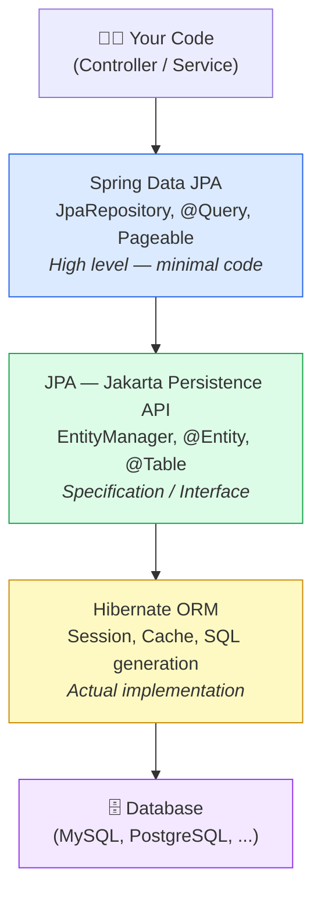
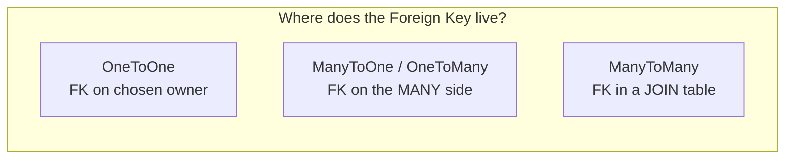
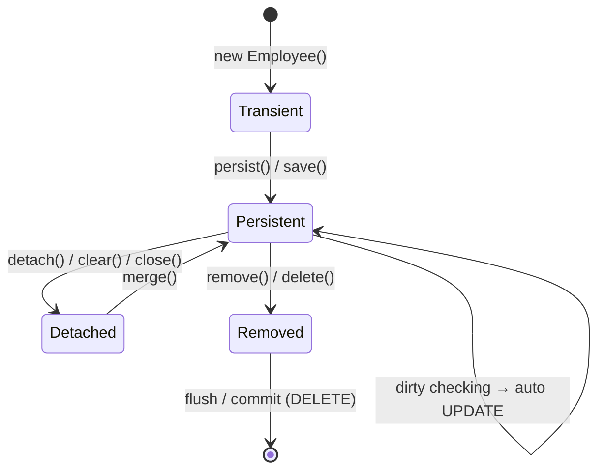
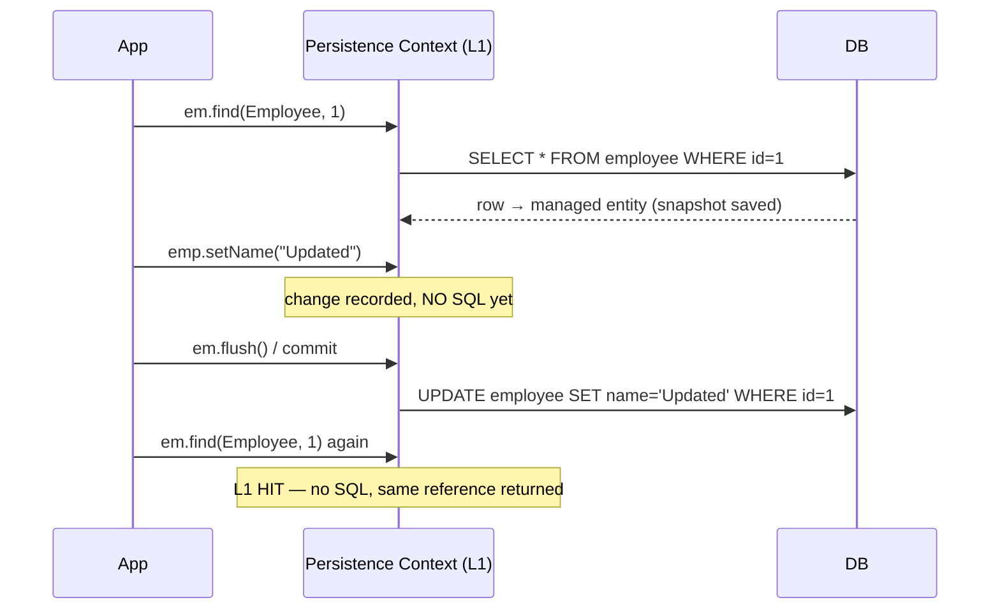
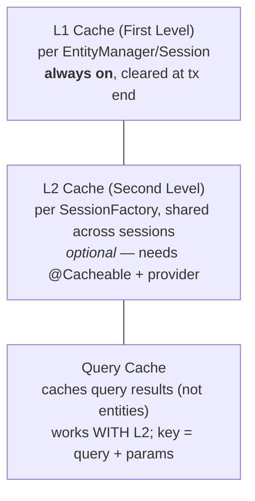
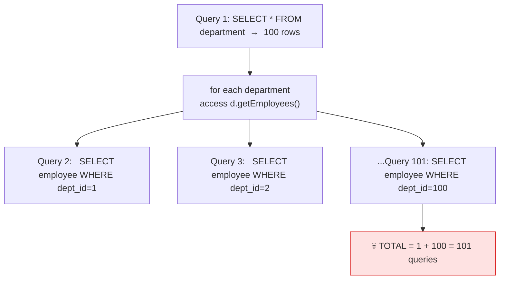
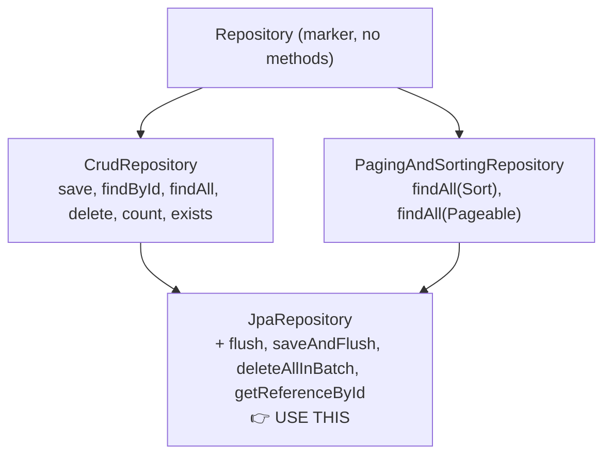

# 🚀 Hibernate & Spring Data JPA — Complete Revision Notes

> **One file. All topics. Built for fast revision + interviews (3.5+ yrs).**
> Hinglish explanations (jaise samajhne mein aasaan ho) + clean, *corrected*, *modern* (Hibernate 6 / Spring Boot 3 / `jakarta.*`) code.

---

## 🧭 How to use these notes

| Symbol | Meaning |
|:---:|---|
| 🔧 **Fix / Modern** | A correction to the original notes, or a modern Hibernate 6 / Boot 3 update |
| ✅ | Best practice / do this |
| ❌ | Anti-pattern / avoid this |
| ⚠️ | Common trap / gotcha |
| 🧠 | Memory trick |
| 🏆 | Cheat sheet / quick reference |

For interview prep, jump to [§19 Interview Q&A](#19--interview-qa-self-test) — answers are **collapsed**, so you can test yourself first.

---

## 📚 Table of Contents

1. [The Big Picture — JDBC vs Hibernate vs JPA vs Spring Data JPA](#1--the-big-picture)
2. [Entities & Tables](#2--entities--tables)
3. [Relationships (1:1, 1:N, N:1, N:N)](#3--relationships)
4. [Entity Lifecycle (4 States)](#4--entity-lifecycle)
5. [Persistence Context, Dirty Checking & Caching](#5--persistence-context-dirty-checking--caching)
6. [Cascade & orphanRemoval](#6--cascade--orphanremoval)
7. [FetchType & the N+1 Problem](#7--fetchtype--the-n1-problem)
8. [Transactions (@Transactional)](#8--transactions)
9. [Queries (Naming, @Query, Specification, Criteria, QueryDSL)](#9--queries)
10. [Sorting & Pagination](#10--sorting--pagination)
11. [Projections](#11--projections)
12. [Repository Interfaces](#12--repository-interfaces)
13. [Inheritance Mapping](#13--inheritance-mapping)
14. [Locking (Optimistic vs Pessimistic)](#14--locking)
15. [Patterns: Soft Delete, Auditing, @Embeddable, Validation, Listeners](#15--patterns)
16. [Performance Tuning](#16--performance-tuning)
17. [Custom Types & Converters](#17--custom-types--converters)
18. [Custom Repo, NamedQuery, Stored Procedures, Testing, Flyway, Data REST](#18--more-tools)
19. [Interview Q&A (Self-Test)](#19--interview-qa-self-test)
20. [Ultimate Cheat Sheet + Corrections Log](#20--ultimate-cheat-sheet)

---

## 1️⃣ The Big Picture

### Layered architecture (top = easy, bottom = raw)



### Who is who?

| Feature | JDBC | Hibernate ORM | JPA | Spring Data JPA |
|---|---|---|---|---|
| **Kya hai?** | Direct DB connection | ORM implementation | Specification (interface) | Abstraction over JPA |
| **SQL likhna** | Manual | HQL / Criteria | JPQL | Auto-generated + custom |
| **Boilerplate** | Bahut zyada | Medium | Medium | Minimal |
| **Repository** | DAO pattern | `Session` | `EntityManager` | `JpaRepository` |
| **Pagination** | Manual SQL | Manual | `setMaxResults` | `Pageable` (1 line!) |
| **Caching** | ❌ | L1 + L2 | L1 (via PC) | Same as JPA |

🧠 **Analogy**

```
JDBC            = Manual gear car   (sab khud karo)
Hibernate       = Automatic car     (engine khud shift kare)
JPA             = "Car interface"   (define karta hai gear hona chahiye)
Spring Data JPA = Self-driving car  (bas destination batao)
```

### Same operation, four ways

```java
// ═══ JDBC — bahut code ═══
Connection conn = DriverManager.getConnection(url, user, pass);
PreparedStatement ps = conn.prepareStatement("SELECT * FROM employee WHERE id = ?");
ps.setLong(1, id);
ResultSet rs = ps.executeQuery();
Employee emp = null;
if (rs.next()) { emp = new Employee(); emp.setId(rs.getLong("id")); /* ...har column manually... */ }
rs.close(); ps.close(); conn.close();              // cleanup khud karo!

// ═══ Hibernate ORM ═══
Session session = sessionFactory.openSession();
Employee emp = session.get(Employee.class, id);
session.close();

// ═══ JPA ═══
EntityManager em = emf.createEntityManager();
Employee emp = em.find(Employee.class, id);
em.close();

// ═══ Spring Data JPA — 1 line ═══
public interface EmployeeRepository extends JpaRepository<Employee, Long> {}
// Usage: employeeRepository.findById(1L);  ← findById already inherited!
```

---

## 2️⃣ Entities & Tables

```
Entity (Java)        ⟷        Table (Database)
Class                ⟷        Table
Field / Property     ⟷        Column
Object / Instance    ⟷        Row
Annotation           ⟷        Constraint (PK, FK, NOT NULL, ...)
```

### All-important annotations (one cleaned-up entity)

```java
@Entity                                    // Ye class ek DB table hai
@Table(name = "employees")                 // Table name (optional; default = class name)
public class Employee {

    @Id                                    // Primary Key
    @GeneratedValue(strategy = GenerationType.IDENTITY)  // auto-increment
    private Long id;

    @Column(name = "emp_name", nullable = false, unique = true, length = 100)
    private String name;

    @Column(name = "salary", precision = 10, scale = 2)  // DECIMAL(10,2)
    private BigDecimal salary;

    @Column(name = "email", unique = true)
    private String email;

    @Enumerated(EnumType.STRING)           // store enum as text, NOT ordinal int
    @Column(name = "status")
    private EmployeeStatus status;         // ACTIVE, INACTIVE

    private LocalDate joiningDate;         // 🔧 see note below
    private LocalDateTime createdAt;       // 🔧 single createdAt, not duplicated

    @Lob                                   // Large Object (BLOB / CLOB)
    private byte[] profileImage;

    @Transient                             // NOT persisted to DB
    private String tempData;
}
```

> 🔧 **Fix / Modern**
> - The original sample declared **`createdAt` twice** (once as `Date`, once as `LocalDateTime`) — that won't compile. Use **one** field.
> - Prefer `java.time` types (`LocalDate`, `LocalDateTime`, `Instant`). With these you **don't need `@Temporal`** at all. `@Temporal` + `java.util.Date` is legacy.
> - `@Enumerated(EnumType.STRING)` is strongly preferred over the default `ORDINAL` — reordering enum constants silently corrupts `ORDINAL` data.

### Primary-key generation strategies

| Strategy | How | Best for |
|---|---|---|
| **IDENTITY** | DB auto-increment | MySQL, SQL Server — most common |
| **SEQUENCE** | DB sequence, pre-allocates IDs | PostgreSQL, Oracle — best for batch inserts |
| **TABLE** | Separate table for IDs | Portable but slow — avoid |
| **AUTO** | Provider decides | Unpredictable — avoid in prod |
| **UUID** | App-generated UUID | Distributed systems *(JPA 3.1 / Hibernate 6+)* |

> ⚠️ With `IDENTITY`, Hibernate **cannot batch inserts** (it needs the generated id immediately). For high-volume inserts on PostgreSQL/Oracle, use `SEQUENCE`.

### Composite primary keys — two ways

```java
// WAY 1 — @IdClass
@Entity
@IdClass(EmployeeProjectId.class)
public class EmployeeProject {
    @Id private Long employeeId;
    @Id private Long projectId;
    private LocalDate assignedDate;
}
public class EmployeeProjectId implements Serializable {
    private Long employeeId;
    private Long projectId;
    // MUST implement equals() + hashCode()
}

// WAY 2 — @EmbeddedId
@Entity
public class EmployeeProject {
    @EmbeddedId private EmployeeProjectId id;
    private LocalDate assignedDate;
}
@Embeddable
public class EmployeeProjectId implements Serializable {
    private Long employeeId;
    private Long projectId;
    // MUST implement equals() + hashCode()
}
```

---

## 3️⃣ Relationships

| Relationship | Owner-side annotation | Example |
|---|---|---|
| **One To One** | `@OneToOne` | 1 User → 1 Passport |
| **Many To One** | `@ManyToOne` | Many Employees → 1 Department |
| **One To Many** | `@OneToMany(mappedBy=...)` | 1 Department → Many Employees |
| **Many To Many** | `@ManyToMany` + `@JoinTable` | Many Students ↔ Many Courses |

> 🧠 **Owner side = jis table mein FK column hota hai.** The owner controls the FK; the other side uses `mappedBy` and is called the *inverse* side.

### 3.1 One To One

```
user_table                    passport_table
----------                    --------------
id (PK)                       id (PK)
name                          passport_number
email                         user_id (FK → user_table.id)   ← FK lives here
```

> 🔧 **Fix** — The original notes labelled **User** as the owner, which contradicts its own diagram. Since the **FK (`user_id`) is in `passport_table`, `Passport` is the OWNER** and `User` is the inverse side (`mappedBy`).

```java
// OWNER — holds the FK
@Entity
public class Passport {
    @Id @GeneratedValue(strategy = GenerationType.IDENTITY)
    private Long id;
    private String passportNumber;

    @OneToOne(fetch = FetchType.LAZY)
    @JoinColumn(name = "user_id")          // FK column → owner side
    private User user;
}

// INVERSE — uses mappedBy, no FK
@Entity
public class User {
    @Id @GeneratedValue(strategy = GenerationType.IDENTITY)
    private Long id;
    private String name;

    @OneToOne(mappedBy = "user", cascade = CascadeType.ALL)
    private Passport passport;
}
```

### 3.2 Many To One  (the simplest, always the owner)

```
department_table              employee_table
----------------              --------------
id (PK)                       id (PK)
name                          emp_name
                              department_id (FK → department_table.id)  ← FK here
```

```java
@Entity
public class Employee {
    @Id @GeneratedValue(strategy = GenerationType.IDENTITY)
    private Long id;
    private String empName;

    @ManyToOne(fetch = FetchType.LAZY)     // ✅ LAZY (default is EAGER — override it)
    @JoinColumn(name = "department_id")    // FK column name
    private Department department;
}
```

- `@ManyToOne` is **always the owner** (FK sits on the "many" side).
- `@JoinColumn` names the FK column.

### 3.3 One To Many  (the mirror of ManyToOne)

```java
@Entity
public class Department {
    @Id @GeneratedValue(strategy = GenerationType.IDENTITY)
    private Long id;
    private String name;

    @OneToMany(mappedBy = "department", cascade = CascadeType.ALL, orphanRemoval = true)
    private List<Employee> employees = new ArrayList<>();
}
```

- `@OneToMany` is the **inverse** side → uses `mappedBy`.
- FK still lives in the **"many"** table (same as ManyToOne).
- ⚠️ `@OneToMany` **without** a matching `@ManyToOne` (i.e. a *unidirectional* `@OneToMany` without `@JoinColumn`) makes Hibernate create an **extra JOIN table**. To avoid it, either pair it with `@ManyToOne` (bidirectional) or add `@JoinColumn` on the `@OneToMany`.

### 3.4 Many To Many

```
student_table     course_table      student_course (JOIN TABLE)
-------------     ------------      --------------------------
id (PK)           id (PK)           student_id (FK → student.id)
name              course_name       course_id  (FK → course.id)
```

```java
@Entity
public class Student {
    @Id @GeneratedValue(strategy = GenerationType.IDENTITY)
    private Long id;
    private String name;

    @ManyToMany(cascade = {CascadeType.PERSIST, CascadeType.MERGE})  // ✅ never ALL/REMOVE
    @JoinTable(name = "student_course",
        joinColumns = @JoinColumn(name = "student_id"),
        inverseJoinColumns = @JoinColumn(name = "course_id"))
    private Set<Course> courses = new HashSet<>();   // Set avoids duplicate-row issues
}

@Entity
public class Course {
    @Id @GeneratedValue(strategy = GenerationType.IDENTITY)
    private Long id;
    private String courseName;

    @ManyToMany(mappedBy = "courses")     // inverse side
    private Set<Student> students = new HashSet<>();
}
```

> ✅ **Pro tip:** In real projects, prefer a **join entity** (e.g. `Enrollment` with its own `@ManyToOne` to both sides) instead of raw `@ManyToMany`. You almost always end up needing extra columns (grade, enrolledOn, status).

### 🔑 Confusion-killer — Golden Rules



1. **FK rule** — FK lives on the *many* side; for `@ManyToMany` it lives in a separate join table.
2. **`mappedBy` rule** — always on the **inverse (non-owner)** side; its value = the field name on the *owner* side.
3. **Owner rule** — owner = the entity whose table holds the FK (or, for M:N, the side with `@JoinTable`).
4. **Fetch/Cascade** — see [§6](#6--cascade--orphanremoval) and [§7](#7--fetchtype--the-n1-problem).

### 🧠 Memory trick

```
@ManyToOne  → "Mai (employee) kisi ko (department) belong karta hoon"
              FK meri table mein → mai OWNER hoon
@OneToMany  → "Mere (department) bahut saare (employees) hain"
              FK meri table mein NAHI → mappedBy mere pe → mai INVERSE
@OneToOne   → "Mera ek hi (passport) hai" → jiski table mein FK, wahi owner
@ManyToMany → "Hum sab sab le sakte hain" → alag JOIN table; @JoinTable owner pe
```

---

## 4️⃣ Entity Lifecycle



| State | Meaning | In Persistence Context? | Has ID? | Changes tracked? |
|---|---|:---:|:---:|:---:|
| **Transient** | Just `new`-ed, never saved | ❌ | ❌ | ❌ |
| **Persistent** | Managed by Hibernate | ✅ | ✅ | ✅ (auto-synced) |
| **Detached** | Was managed, now outside PC | ❌ | ✅ | ❌ |
| **Removed** | Marked for deletion | ✅ | ✅ | Deleted on flush |

```java
Employee emp = new Employee("Rahul");   // TRANSIENT
em.persist(emp);                        // → PERSISTENT (ID assigned, tracked)

emp.setName("Rahul-Updated");           // no save() needed! dirty checking → UPDATE on flush

em.detach(emp);                         // → DETACHED (changes no longer tracked)
emp.setName("ignored");                 // this change will NOT reach DB
Employee managed = em.merge(emp);       // re-attach → returns a managed copy

em.remove(managed);                     // → REMOVED → DELETE on flush
```

### Lifecycle callbacks

| Annotation | Fires |
|---|---|
| `@PrePersist` / `@PostPersist` | before / after INSERT |
| `@PreUpdate` / `@PostUpdate` | before / after UPDATE |
| `@PreRemove` / `@PostRemove` | before / after DELETE |
| `@PostLoad` | after SELECT (entity loaded) |

```java
@Entity
public class Employee {
    @PrePersist void beforeInsert() { this.createdAt = LocalDateTime.now(); }
    @PreUpdate  void beforeUpdate() { this.updatedAt = LocalDateTime.now(); }
    @PostLoad   void afterLoad()    { /* derived fields, logging, etc. */ }
}
```

---

## 5️⃣ Persistence Context, Dirty Checking & Caching

> **Persistence Context (PC) = a "box" of managed entities** that Hibernate tracks within one `EntityManager`/`Session`. It **is the L1 cache.**



### Key EntityManager methods

| Method | Effect |
|---|---|
| `find(Class, id)` | SELECT now; returns `null` if missing |
| `getReference(Class, id)` | Returns **lazy proxy**, no SQL until field access; `EntityNotFoundException` on access if missing |
| `persist(e)` | INSERT (on flush); throws if entity is detached |
| `merge(e)` | INSERT-or-UPDATE; **returns a managed copy** (original stays detached) |
| `remove(e)` | DELETE (on flush) |
| `detach(e)` / `clear()` | Evict one / all entities from PC |
| `flush()` | Push PC changes to DB (no commit) |
| `refresh(e)` | Reload from DB, **discards local changes** |
| `contains(e)` | Is this entity currently managed? |

### Dirty checking

```
Load   : entity = {name:"Rahul", salary:50000}   snapshot = {name:"Rahul", salary:50000}
Change : entity = {name:"Rahul-Updated", ...}    snapshot unchanged
Flush  : compare entity vs snapshot → only `name` changed
         → UPDATE employee SET name='Rahul-Updated' WHERE id=1   (only changed column*)
```

> ✅ For a **managed** entity you never call `save()` to update — just mutate it inside a transaction.
> *By default Hibernate may include all columns in the UPDATE; add `@DynamicUpdate` to update only changed columns (see [§16](#16--performance-tuning)).

### Cache levels



```java
@Entity
@Cacheable
@org.hibernate.annotations.Cache(usage = CacheConcurrencyStrategy.READ_WRITE)
public class Country {       // rarely changes → perfect for L2
    @Id private Long id;
    private String name;
}
```

> 🔧 **Fix / Modern (Hibernate 6 / Spring Boot 3):** L2 setup now uses **JCache + EhCache 3**, not the old `EhCacheRegionFactory`, and properties are under `jakarta.*` not `javax.*`:
> ```properties
> spring.jpa.properties.hibernate.cache.use_second_level_cache=true
> spring.jpa.properties.hibernate.cache.region.factory_class=org.hibernate.cache.jcache.JCacheRegionFactory
> spring.jpa.properties.jakarta.persistence.sharedCache.mode=ENABLE_SELECTIVE
> ```

| Use L2 cache when | Avoid L2 cache when |
|---|---|
| ✅ Data rarely changes (country, config, master data) | ❌ Write-heavy / frequently changing (orders, txns) |
| ✅ Read-heavy, write-light | ❌ Real-time data required |
| ✅ Same data read across transactions | ❌ Strong consistency required |

---

## 6️⃣ Cascade & orphanRemoval

> **Cascade = parent ka operation child tak propagate karo.**

| CascadeType | Propagates | Example |
|---|---|---|
| **ALL** | everything | Department delete → Employees delete |
| **PERSIST** | save/insert | Department save → Employees save |
| **MERGE** | update | Department update → Employees update |
| **REMOVE** | delete | Department delete → Employees delete |
| **REFRESH** | reload | Department refresh → Employees refresh |
| **DETACH** | evict | Department detach → Employees detach |

### 🏆 Which cascade for which relationship?

| Relationship | Recommended | Why |
|---|---|---|
| `@OneToOne` (User–Passport) | `CascadeType.ALL` | Passport can't outlive its User |
| `@OneToMany` (Dept–Employee) | `CascadeType.ALL` + `orphanRemoval=true` | Children belong to parent |
| `@ManyToOne` (Employee–Dept) | **no cascade** | Deleting an employee must NOT delete the department |
| `@ManyToMany` (Student–Course) | `{PERSIST, MERGE}` only | ❌ `ALL`/`REMOVE` would delete shared rows others depend on |

> ⚠️ **Never put cascade on both sides** of a bidirectional relationship → risk of infinite recursion / accidental mass-delete.

### orphanRemoval

```
orphanRemoval = true  → child removed from parent's collection ⇒ child DELETED from DB
orphanRemoval = false → child just gets its FK set to NULL (stays in DB, parentless)
```

```java
@OneToMany(mappedBy = "department", cascade = CascadeType.ALL, orphanRemoval = true)
private List<Employee> employees = new ArrayList<>();

public void removeEmployee(Employee e) {
    employees.remove(e);
    e.setDepartment(null);     // orphan → auto-DELETE on flush, no repo.delete() needed
}
```

| `CascadeType.REMOVE` | `orphanRemoval = true` |
|---|---|
| **Parent** deleted → all children deleted | A **specific child** removed from collection → that child deleted |
| Bulk delete | Selective delete |

✅ Common combo: `@OneToMany(cascade = CascadeType.ALL, orphanRemoval = true)`.

---

## 7️⃣ FetchType & the N+1 Problem

| FetchType | Behaviour | Default on |
|---|---|---|
| **EAGER** | load related data **immediately** (JOIN) | `@ManyToOne`, `@OneToOne` |
| **LAZY** | load **only when accessed** (proxy) | `@OneToMany`, `@ManyToMany` |

```java
Department d = repo.findById(1L).get();   // LAZY: SELECT department only
d.getEmployees().size();                  // NOW: SELECT employees WHERE department_id=1
```

### ⚠️ LazyInitializationException

Accessing a LAZY association **after the transaction/Session has closed** throws
`could not initialize proxy - no Session`.

**Fixes:**
```java
// 1) Keep the session open
@Transactional(readOnly = true)
public DepartmentDTO get(Long id) { ... d.getEmployees().size() ... }   // ✅

// 2) JOIN FETCH in the query
@Query("SELECT d FROM Department d JOIN FETCH d.employees WHERE d.id = :id")
Department findByIdWithEmployees(@Param("id") Long id);

// 3) @EntityGraph (declarative, LEFT JOIN)
@EntityGraph(attributePaths = {"employees"})
Optional<Department> findById(Long id);

// 4) DTO projection (no entity, no lazy issue) — best
```

### The N+1 problem



> N+1 strikes with **LAZY accessed in a loop** *and* with **EAGER on a collection** (one extra query per parent).

### ✅ Four solutions

| Solution | How | Best for |
|---|---|---|
| **JOIN FETCH** | `@Query("... JOIN FETCH d.employees")` | specific queries; you know the associations |
| **@EntityGraph** | `@EntityGraph(attributePaths={"employees"})` | override fetch plan without JPQL (uses LEFT JOIN) |
| **Batch fetching** | `hibernate.default_batch_fetch_size=50` or `@BatchSize(size=50)` | global safety net; turns N+1 into N/batch via `IN (...)` |
| **DTO projection** | `SELECT new ...DTO(...)` | best performance, only the columns you need |

```properties
# global batch fetching → 101 queries become ~3
spring.jpa.properties.hibernate.default_batch_fetch_size=50
```

> ⚠️ **JOIN FETCH gotcha:** `JOIN FETCH` of a **collection** + `Pageable` cannot paginate in the DB — Hibernate pages **in memory** (loads everything, then slices) and logs a warning. For paginated collection fetches, fetch IDs first (two-query approach) or use `@EntityGraph` with batch size. Also use `DISTINCT` (or `Set`) to dedupe cartesian rows.

---

## 8️⃣ Transactions

> **Transaction = ek unit of work — ya poora ho, ya kuch bhi na ho (ROLLBACK).**

```java
@Transactional                                  // all-or-nothing
public void createDepartmentWithEmployees() {
    Department d = new Department("IT");
    d.addEmployee(new Employee("Rahul"));
    d.addEmployee(new Employee("Amit"));
    departmentRepository.save(d);
    // error anywhere here → entire thing rolls back
}
```

### Key properties

| Property | Purpose | Default |
|---|---|---|
| `readOnly` | read-only optimization (skips dirty checking) | `false` |
| `timeout` | seconds before forced rollback | -1 |
| `rollbackFor` | which exceptions trigger rollback | `RuntimeException` only |
| `propagation` | how it joins/creates transactions | `REQUIRED` |
| `isolation` | DB isolation level | `DEFAULT` |

> ⚠️ By default Spring rolls back only on **unchecked** (`RuntimeException`) exceptions. For checked exceptions you must say `@Transactional(rollbackFor = Exception.class)`.

### Propagation (most important)

| Propagation | Behaviour |
|---|---|
| **REQUIRED** *(default)* | join existing tx, else create new |
| **REQUIRES_NEW** | always new tx; suspend the current one |
| **SUPPORTS** | use tx if present, else run non-tx |
| **NOT_SUPPORTED** | run non-tx; suspend any current tx |
| **MANDATORY** | must already be in a tx, else error |
| **NEVER** | must NOT be in a tx, else error |
| **NESTED** | nested savepoint (rolls back to savepoint) |

```java
// independent logging that must survive the parent's rollback
@Transactional(propagation = Propagation.REQUIRES_NEW)
public void logError(Employee e, Exception ex) { errorLogRepository.save(new ErrorLog(...)); }
```

### ⚠️ Self-invocation trap

```java
@Service
public class EmployeeService {
    @Transactional public void method1() { ... }

    public void method2() {
        this.method1();   // ❌ @Transactional IGNORED — proxy bypassed on self-call
    }
}
```
`@Transactional` works via a Spring proxy. Calling `this.method1()` skips the proxy → no transaction. Fix: move the method to another bean, inject self, or use `AopContext.currentProxy()`.

> ⚠️ Only **`public`** methods are proxied for `@Transactional` (with the default Spring AOP proxy).

---

## 9️⃣ Queries

### 9.1 Derived query methods (Spring builds SQL from the method name)

```java
public interface EmployeeRepository extends JpaRepository<Employee, Long> {
    List<Employee> findByName(String name);
    Employee       findByEmail(String email);
    List<Employee> findByNameAndDepartment(String name, String dept);
    List<Employee> findByNameOrEmail(String name, String email);

    List<Employee> findBySalaryGreaterThan(BigDecimal s);
    List<Employee> findBySalaryBetween(BigDecimal min, BigDecimal max);

    List<Employee> findByNameContaining(String kw);      // %kw%
    List<Employee> findByNameStartingWith(String p);     // p%
    List<Employee> findByDepartmentIn(List<String> d);   // IN (...)
    List<Employee> findByManagerIsNull();
    List<Employee> findByActiveTrue();

    List<Employee> findByDepartmentOrderByNameAsc(String d);
    List<Employee> findTop10ByOrderBySalaryDesc();
    Employee       findFirstByOrderBySalaryDesc();

    long    countByDepartment(String d);
    boolean existsByEmail(String e);
    long    deleteByActiveFalse();                        // needs @Transactional
}
```

| Keyword | SQL |
|---|---|
| `And` / `Or` | `AND` / `OR` |
| `Between` | `BETWEEN ? AND ?` |
| `LessThan` / `GreaterThan` / `…Equal` | `<` / `>` / `<= >=` |
| `Like` / `Containing` / `StartingWith` / `EndingWith` | `LIKE`, `%x%`, `x%`, `%x` |
| `In` / `NotIn` | `IN` / `NOT IN` |
| `IsNull` / `IsNotNull` | `IS (NOT) NULL` |
| `True` / `False` | `= true` / `= false` |
| `OrderBy…Asc/Desc` | `ORDER BY … ASC/DESC` |
| `Top` / `First` | `LIMIT` |

### 9.2 @Query — JPQL & native SQL

```java
// JPQL — uses ENTITY + FIELD names
@Query("SELECT e FROM Employee e WHERE e.department = :dept AND e.salary > :min")
List<Employee> find(@Param("dept") String dept, @Param("min") BigDecimal min);

@Query("SELECT e FROM Employee e JOIN FETCH e.department")   // solves N+1
List<Employee> findAllWithDepartment();

@Modifying                                                   // required for UPDATE/DELETE
@Query("UPDATE Employee e SET e.salary = :s WHERE e.department = :d")
int raiseSalary(@Param("s") BigDecimal s, @Param("d") String d);

// NATIVE — uses TABLE + COLUMN names
@Query(value = "SELECT * FROM employees WHERE salary > :min", nativeQuery = true)
List<Employee> findHighEarners(@Param("min") BigDecimal min);
```

> ⚠️ `@Modifying` queries **must** run inside `@Transactional`, and they **bypass** the persistence context (stale L1 entities possible → add `@Modifying(clearAutomatically = true, flushAutomatically = true)` if needed).

### 9.3 Specification — dynamic filters

> Use when a search form has many **optional** filters (2ⁿ combinations — don't write 2ⁿ methods!).

```java
public interface EmployeeRepository extends JpaRepository<Employee, Long>,
                                            JpaSpecificationExecutor<Employee> {}

public class EmployeeSpecs {
    public static Specification<Employee> hasName(String n) {
        return (root, q, cb) -> n == null ? null : cb.equal(root.get("name"), n);
    }
    public static Specification<Employee> salaryGoe(BigDecimal min) {
        return (root, q, cb) -> min == null ? null : cb.greaterThanOrEqualTo(root.get("salary"), min);
    }
}

// combine only the provided filters
Specification<Employee> spec = Specification.where(null);
if (name != null) spec = spec.and(EmployeeSpecs.hasName(name));
if (min  != null) spec = spec.and(EmployeeSpecs.salaryGoe(min));
List<Employee> result = employeeRepository.findAll(spec);
```

### 9.4 Criteria API — programmatic, type-unsafe

```java
CriteriaBuilder cb = em.getCriteriaBuilder();
CriteriaQuery<Employee> cq = cb.createQuery(Employee.class);
Root<Employee> root = cq.from(Employee.class);
List<Predicate> p = new ArrayList<>();
if (dept != null) p.add(cb.equal(root.get("department"), dept));
if (min  != null) p.add(cb.greaterThanOrEqualTo(root.get("salary"), min));
cq.where(p.toArray(new Predicate[0])).orderBy(cb.asc(root.get("name")));
return em.createQuery(cq).getResultList();
```

### 9.5 QueryDSL — type-safe & readable (best for complex dynamic)

```java
QEmployee e = QEmployee.employee;
BooleanBuilder b = new BooleanBuilder();
if (name != null) b.and(e.name.containsIgnoreCase(name));
if (min  != null) b.and(e.salary.goe(min));               // goe = >=
return queryFactory.selectFrom(e).where(b).orderBy(e.name.asc()).fetch();
```

```
Criteria: cb.equal(root.get("departmnt"), d)   ← typo compiles, fails at runtime ❌
QueryDSL: QEmployee.employee.department.eq(d)   ← compile-time safe ✅
```

### 🏆 Which approach when?

| Approach | Use when |
|---|---|
| Derived method names | simple, 1–2 fixed conditions |
| `@Query` (JPQL) | fixed complex query with joins, known at dev time |
| `@Query` (native) | DB-specific SQL JPQL can't express |
| Specification | dynamic optional filters (search forms) |
| Criteria API | very complex dynamic (aggregations, subqueries) |
| QueryDSL | same as Criteria but type-safe — best for big projects |

---

## 🔟 Sorting & Pagination

> Without pagination, loading 1 lakh rows = OOM, slow network, hung UI, API timeout.

```java
Pageable pageable = PageRequest.of(0, 10, Sort.by("name").ascending());  // page 0, size 10
Page<Employee> page = employeeRepository.findAll(pageable);

page.getContent();        // List<Employee>
page.getTotalElements();  // total rows
page.getTotalPages();
page.getNumber();         // current page (0-indexed)
page.hasNext();           // more pages?

// multi-sort
Sort sort = Sort.by("department").ascending().and(Sort.by("name").descending());

// custom repo method
Page<Employee> findByDepartment(String dept, Pageable pageable);
```

### Page vs Slice

| | runs COUNT query? | knows total pages? | use for |
|---|:---:|:---:|---|
| **`Page`** | ✅ | ✅ | numbered pagination (1,2,3…10) |
| **`Slice`** | ❌ (faster) | ❌ | infinite scroll / "Load more" |

```java
@GetMapping
public Page<Employee> list(@RequestParam(defaultValue="0") int page,
                           @RequestParam(defaultValue="10") int size) {
    return employeeRepository.findAll(PageRequest.of(page, size, Sort.by("name")));
}
// GET /api/employees?page=0&size=10&sort=name,asc
```

> ✅ Spring MVC can inject `Pageable` directly as a controller argument — no manual parsing needed.

---

## 1️⃣1️⃣ Projections

> **Projection = sirf zaroori columns lao, poora entity mat lao** → faster, less memory.

```java
// 1) Interface-based (simplest) — getter names match entity fields
public interface EmployeeNameOnly { Long getId(); String getName(); }
List<EmployeeNameOnly> findByDepartment(String dept);   // SELECT id, name only

// 2) Class-based DTO — JPQL constructor expression
public record EmployeeDTO(Long id, String name, String departmentName) {}
@Query("SELECT new com.app.dto.EmployeeDTO(e.id, e.name, d.name) FROM Employee e JOIN e.department d")
List<EmployeeDTO> findAllDTOs();

// 3) Dynamic — choose projection at runtime
<T> List<T> findByDepartment(String dept, Class<T> type);
repo.findByDepartment("IT", EmployeeNameOnly.class);
repo.findByDepartment("IT", EmployeeDTO.class);
```

> 🔧 **Modern:** Java `record`s make class-based DTO projections one-liners and work great with JPQL constructor expressions.

---

## 1️⃣2️⃣ Repository Interfaces



> 🔧 **Fix / Modern (Spring Data 3.x):** The hierarchy changed — `PagingAndSortingRepository` **no longer extends** `CrudRepository`. `JpaRepository` now extends both `ListCrudRepository` and `ListPagingAndSortingRepository` (their `findAll` returns `List`, not `Iterable`). For everyday use, **just extend `JpaRepository`** and you get everything.

| Interface | Adds |
|---|---|
| `CrudRepository` | `save`, `findById`, `findAll`, `delete`, `count`, `existsById` |
| `PagingAndSortingRepository` | `findAll(Sort)`, `findAll(Pageable)` |
| `JpaRepository` | `flush`, `saveAndFlush`, `deleteAllInBatch`, `getReferenceById`, list-returning `findAll` |

```java
public interface EmployeeRepository extends JpaRepository<Employee, Long> {
    Employee       save(Employee e);                 // INSERT or UPDATE
    Employee       saveAndFlush(Employee e);         // save + immediate flush
    Optional<Employee> findById(Long id);
    void           deleteAllInBatch();               // single DELETE (fast, skips callbacks/cascade)
    boolean        existsById(Long id);
    long           count();
}
```

> ⚠️ `deleteAll()` loads each entity and deletes one-by-one (cascades + callbacks fire). `deleteAllInBatch()` issues **one** `DELETE` — fast, but **no cascading and no lifecycle callbacks**.

---

## 1️⃣3️⃣ Inheritance Mapping

| Strategy | Tables | Pros | Cons |
|---|---|---|---|
| **SINGLE_TABLE** *(default)* | 1 + discriminator column | fastest, no joins | nullable columns, no NOT-NULL on subclass fields |
| **JOINED** | 1 per class + FK joins | normalized, no nullable issue | slower (joins) |
| **TABLE_PER_CLASS** | 1 per concrete class | no joins per type | `UNION` for polymorphic queries (slow), duplicate columns |

```java
// SINGLE_TABLE — one "vehicle" table with a vehicle_type discriminator
@Entity
@Inheritance(strategy = InheritanceType.SINGLE_TABLE)
@DiscriminatorColumn(name = "vehicle_type")
public abstract class Vehicle { @Id Long id; String manufacturer; }

@Entity @DiscriminatorValue("CAR")  class Car  extends Vehicle { Integer numberOfDoors; }
@Entity @DiscriminatorValue("BIKE") class Bike extends Vehicle { Integer engineCC; }
```
```
vehicle:  | id | manufacturer | vehicle_type | number_of_doors | engine_cc |
          |  1 | Toyota       | CAR          | 4               | NULL      |
          |  2 | Honda        | BIKE         | NULL            | 150       |
```

- **JOINED** → `@Inheritance(strategy = InheritanceType.JOINED)` → tables `vehicle`, `car(id FK)`, `bike(id FK)`; reads join parent+child.
- **TABLE_PER_CLASS** → independent `car` & `bike` tables (no `vehicle` table); "all vehicles" = `UNION`.

> ✅ Default to **SINGLE_TABLE** for performance; switch to **JOINED** when you genuinely need NOT-NULL constraints / normalization on subclass columns.

---

## 1️⃣4️⃣ Locking

> **Lost-update problem:** two threads read salary=50000, both write → one update silently lost.

### Optimistic (default choice) — no real DB lock, just a version check

```java
@Entity
public class Employee {
    @Id Long id;
    BigDecimal salary;
    @Version Long version;     // ✅ Hibernate manages this
}
// UPDATE ... SET salary=?, version=version+1 WHERE id=? AND version=?
// 0 rows updated → OptimisticLockException (someone else changed it)
```
✅ Best for low contention / web apps (most cases). Handle/retry on `OptimisticLockException`.

### Pessimistic — actual DB row lock

```java
@Lock(LockModeType.PESSIMISTIC_WRITE)              // SELECT ... FOR UPDATE
@Query("SELECT e FROM Employee e WHERE e.id = :id")
Employee findByIdForUpdate(@Param("id") Long id);
```
- `PESSIMISTIC_READ` → shared lock (others may read, not write).
- `PESSIMISTIC_WRITE` → exclusive lock (`FOR UPDATE`; others blocked).

✅ Best for high contention / money / inventory. ⚠️ Risk of deadlocks.

| | Optimistic | Pessimistic |
|---|---|---|
| Mechanism | `@Version` check | DB row lock |
| Performance | better | slower |
| Conflict | exception (retry) | prevented (blocks) |
| Deadlock | none | possible |
| Implementation | `@Version` | `@Lock` |

---

## 1️⃣5️⃣ Patterns

### Soft delete

```java
// 🔧 Modern (Hibernate 6.3+): @Where is DEPRECATED → use @SQLRestriction
@Entity
@SQLRestriction("deleted = false")                       // auto-filter on every query
@SQLDelete(sql = "UPDATE employee SET deleted = true WHERE id = ?")  // DELETE → UPDATE
public class Employee {
    @Id Long id;
    String name;
    boolean deleted = false;
}
```
- `findAll()` → only non-deleted rows.
- `deleteById(1L)` → `UPDATE ... SET deleted = true` (row kept for audit/recovery).

> 🔧 **Even newer (Hibernate 6.4+):** the built-in `@SoftDelete` annotation does all of the above in one line:
> ```java
> @Entity
> @SoftDelete(columnName = "deleted")
> public class Employee { @Id Long id; String name; }
> ```

### Auditing — who/when, automatically

```java
@Configuration
@EnableJpaAuditing(auditorAwareRef = "auditorProvider")
public class JpaConfig {
    @Bean AuditorAware<String> auditorProvider() {
        return () -> Optional.ofNullable(SecurityContextHolder.getContext().getAuthentication())
                             .map(Authentication::getName).or(() -> Optional.of("system"));
    }
}

@MappedSuperclass
@EntityListeners(AuditingEntityListener.class)
public abstract class BaseEntity {
    @CreatedDate      @Column(updatable = false) LocalDateTime createdAt;
    @LastModifiedDate                            LocalDateTime updatedAt;
    @CreatedBy        @Column(updatable = false) String createdBy;
    @LastModifiedBy                              String updatedBy;
}

@Entity public class Employee extends BaseEntity { @Id Long id; String name; }
```

**Full history** → Hibernate **Envers** (`@Audited` → creates `employee_aud` table tracking every revision: ADD/MOD/DEL).

### @Embeddable / @Embedded — reusable column groups (value objects)

```java
@Embeddable
public class Address { String street, city, state, zipCode; }   // NO @Id, NO own table

@Entity public class Employee { @Id Long id; @Embedded Address address; }
@Entity public class Company  { @Id Long id; @Embedded Address headquarter; }
// columns (street, city, state, zip_code) live INSIDE each owner table
```
Two of the same type? Disambiguate columns:
```java
@Embedded
@AttributeOverrides({
  @AttributeOverride(name="street", column=@Column(name="home_street")),
  @AttributeOverride(name="city",   column=@Column(name="home_city"))
})
private Address homeAddress;
```

| | `@Embeddable` | `@Entity` |
|---|---|---|
| Own table? | ❌ (columns in owner) | ✅ |
| `@Id`? | ❌ | ✅ |
| Lifecycle | tied to owner | independent |
| Reusable across entities | ✅ | ❌ |

### Bean Validation (`jakarta.validation`)

```java
@Entity
public class Employee {
    @Id @GeneratedValue(strategy = GenerationType.IDENTITY) Long id;

    @NotBlank @Size(min = 2, max = 50) String name;
    @Email   @Column(unique = true)    String email;
    @NotNull @DecimalMin(value = "0.0", inclusive = false) BigDecimal salary;
    @Min(18) @Max(65)                  Integer age;
    @Pattern(regexp = "^\\d{10}$")     String phone;
    @Past                              LocalDate joiningDate;
}

@PostMapping
public ResponseEntity<?> create(@Valid @RequestBody Employee e) { ... }  // fail → 400

@RestControllerAdvice
class GlobalHandler {
  @ExceptionHandler(MethodArgumentNotValidException.class)
  ResponseEntity<Map<String,String>> handle(MethodArgumentNotValidException ex) {
    Map<String,String> errs = new HashMap<>();
    ex.getBindingResult().getFieldErrors().forEach(f -> errs.put(f.getField(), f.getDefaultMessage()));
    return ResponseEntity.badRequest().body(errs);
  }
}
```

| Annotation | Checks |
|---|---|
| `@NotNull` / `@NotBlank` / `@NotEmpty` | not null / + not blank / + not empty |
| `@Size(min,max)` | length/size |
| `@Min` / `@Max` / `@Positive` | numeric bounds |
| `@Email` / `@Pattern` | format / regex |
| `@Past` / `@Future` | date |
| `@DecimalMin` / `@DecimalMax` | decimal bounds |

> 🔧 **Modern:** all under `jakarta.validation.*` (Spring Boot 3), not `javax.validation.*`. Dependency: `spring-boot-starter-validation`.

### Custom entity listeners

```java
public class AuditListener {
    @PrePersist void prePersist(Object e) { /* set createdAt/createdBy */ }
    @PreUpdate  void preUpdate(Object e)  { /* set updatedAt/updatedBy */ }
}
@Entity @EntityListeners(AuditListener.class) public class Employee { ... }
```

---

## 1️⃣6️⃣ Performance Tuning

### Batch inserts/updates

```properties
spring.jpa.properties.hibernate.jdbc.batch_size=50
spring.jpa.properties.hibernate.order_inserts=true
spring.jpa.properties.hibernate.order_updates=true
```
```java
@Transactional
public void bulkInsert(List<Employee> list) {
    for (int i = 0; i < list.size(); i++) {
        em.persist(list.get(i));
        if (i % 50 == 0) { em.flush(); em.clear(); }   // free PC memory, avoid OOM
    }
}
```
> ⚠️ Batching is silently disabled when the entity uses `GenerationType.IDENTITY` — use `SEQUENCE` for batchable inserts.

### Read-only

```java
@Transactional(readOnly = true)         // skips dirty checking + snapshot → faster reports
public List<Employee> report() { ... }
```

### Column-level update & immutables

```java
@Entity @DynamicUpdate public class Employee { ... }   // UPDATE only changed columns
@Entity @Immutable     public class Country  { ... }   // never modified → no dirty checking
```

### Useful properties (dev only — turn off in prod)

```properties
spring.jpa.show-sql=true
spring.jpa.properties.hibernate.format_sql=true
logging.level.org.hibernate.SQL=DEBUG
logging.level.org.hibernate.orm.jdbc.bind=TRACE        # 🔧 Hibernate 6 path for bind params
spring.jpa.properties.hibernate.generate_statistics=true
# HikariCP (default pool)
spring.datasource.hikari.maximum-pool-size=20
spring.datasource.hikari.minimum-idle=5
spring.datasource.hikari.connection-timeout=20000
spring.datasource.hikari.idle-timeout=300000
```
> 🔧 In Hibernate 6 the bind-parameter logger moved from `org.hibernate.type.descriptor.sql.BasicBinder` to `org.hibernate.orm.jdbc.bind`.
> 🧮 Pool sizing rule of thumb: `maximum-pool-size ≈ (core_count * 2) + effective_spindle_count`.

---

## 1️⃣7️⃣ Custom Types & Converters

```java
// store List<String> as "Java,Spring,React"
@Converter
public class StringListConverter implements AttributeConverter<List<String>, String> {
    public String convertToDatabaseColumn(List<String> l) { return l == null ? null : String.join(",", l); }
    public List<String> convertToEntityAttribute(String s) { return s == null ? null : Arrays.asList(s.split(",")); }
}
@Entity public class Employee { @Convert(converter = StringListConverter.class) List<String> skills; }
```

```java
// 🔧 Modern JSON column (Hibernate 6) — replaces the old @Type(type="jsonb")
@JdbcTypeCode(SqlTypes.JSON)
@Column(columnDefinition = "jsonb")
private Map<String, Object> metadata;
```

---

## 1️⃣8️⃣ More Tools

**Custom repository implementation** (mix default + hand-written, name must be `…Impl`):
```java
interface EmployeeRepositoryCustom { List<Employee> search(String c); }
class EmployeeRepositoryImpl implements EmployeeRepositoryCustom {
    @PersistenceContext EntityManager em;
    public List<Employee> search(String c) { /* CriteriaBuilder / native ... */ }
}
interface EmployeeRepository extends JpaRepository<Employee, Long>, EmployeeRepositoryCustom {}
```

**Named queries** (validated at startup, defined on the entity):
```java
@Entity
@NamedQuery(name = "Employee.findAllActive", query = "SELECT e FROM Employee e WHERE e.active = true")
public class Employee { ... }
// repo method named findAllActive() auto-binds; or @Query(name = "Employee.findAllActive")
```

**Stored procedures:**
```java
@Procedure(procedureName = "get_employees_by_dept")
List<Employee> getByDepartment(@Param("dept_name") String dept);
```

**Testing — `@DataJpaTest`:**
```java
@DataJpaTest                              // in-memory DB, only JPA layer, rolls back each test
class EmployeeRepositoryTest {
    @Autowired EmployeeRepository repo;
    @Autowired TestEntityManager tem;
    @Test void findsByName() {
        tem.persistAndFlush(new Employee("Rahul"));
        assertThat(repo.findByName("Rahul")).hasSize(1);
    }
}
```
> ⚠️ `@DataJpaTest` loads only JPA components (repositories, `EntityManager`) — **no** `@Service`/`@Controller`/`@Component`. Each test is transactional and rolled back. By default it swaps in an embedded DB; add `@AutoConfigureTestDatabase(replace = NONE)` to test against the real DB.

**Flyway (DB migration):**
```properties
spring.flyway.enabled=true
spring.flyway.locations=classpath:db/migration
```
```
V<version>__<description>.sql   ← double underscore!  e.g. V2__create_audit_log.sql
V = versioned (run once)   R = repeatable   U = undo
```

**Spring Data REST** (auto REST API from a repository — zero controller code):
```java
@RepositoryRestResource(path = "employees")
public interface EmployeeRepository extends JpaRepository<Employee, Long> {
    List<Employee> findByDepartment(@Param("dept") String dept);
}
// → GET/POST/PUT/DELETE /api/employees, /api/employees/{id},
//   /api/employees/search/findByDepartment?dept=IT, pagination & HAL links built-in
```

---

## 1️⃣9️⃣ Interview Q&A (Self-Test)

> 🔧 The original notes titled this "Top 50" but listed **40**. Here are those 40, corrected — **answers are hidden**, so read the question, answer in your head, then expand.

### 🟢 Basics / Medium

<details><summary><b>Q1.</b> JPA vs Hibernate vs Spring Data JPA?</summary>

JPA = specification (interface). Hibernate = a JPA implementation. Spring Data JPA = abstraction over JPA (auto-generated queries, pagination, less boilerplate).
</details>

<details><summary><b>Q2.</b> What is the Persistence Context?</summary>

The L1 cache where Hibernate tracks managed entities. Auto-detects changes via dirty checking; the same entity in the same transaction is returned without a second DB hit.
</details>

<details><summary><b>Q3.</b> persist() vs merge()?</summary>

`persist()` = INSERT a new entity (fails for detached). `merge()` = INSERT or UPDATE; copies a detached entity's state into a managed instance and **returns that managed instance** (the argument stays detached).
</details>

<details><summary><b>Q4.</b> N+1 problem and solutions?</summary>

1 query loads N parents, then N queries load each parent's children. Fixes: `JOIN FETCH`, `@EntityGraph`, `@BatchSize`/`default_batch_fetch_size`, DTO projection.
</details>

<details><summary><b>Q5.</b> LAZY vs EAGER?</summary>

LAZY = load on access (default for `@OneToMany`/`@ManyToMany`). EAGER = load immediately (default for `@ManyToOne`/`@OneToOne`). Prefer LAZY; fetch explicitly when needed.
</details>

<details><summary><b>Q6.</b> What is dirty checking?</summary>

Hibernate compares a managed entity to its load-time snapshot; if changed, it auto-issues an UPDATE on flush. No explicit `save()` needed for managed entities.
</details>

<details><summary><b>Q7.</b> @Transactional propagation types?</summary>

REQUIRED (default), REQUIRES_NEW, SUPPORTS, NOT_SUPPORTED, MANDATORY, NEVER, NESTED.
</details>

<details><summary><b>Q8.</b> Is CascadeType.ALL safe for @ManyToMany?</summary>

No. REMOVE would cascade to the other side and delete shared rows. Use `{PERSIST, MERGE}` for `@ManyToMany`.
</details>

<details><summary><b>Q9.</b> orphanRemoval vs CascadeType.REMOVE?</summary>

CascadeType.REMOVE: deleting the parent deletes all children. orphanRemoval: removing one child from the parent's collection deletes that specific child (selective).
</details>

<details><summary><b>Q10.</b> find() vs getReference()?</summary>

`find()` hits the DB immediately and returns `null` if absent. `getReference()` returns a lazy proxy, hits the DB only on field access, and throws `EntityNotFoundException` if absent.
</details>

### 🟡 Medium / Advanced (3.5+ yrs)

<details><summary><b>Q11.</b> How does @Version (optimistic locking) work?</summary>

It adds a version column; updates include `WHERE version = X`. If another tx already bumped the version, 0 rows update → `OptimisticLockException`.
</details>

<details><summary><b>Q12.</b> PESSIMISTIC_READ vs PESSIMISTIC_WRITE?</summary>

READ = shared lock (others can read, not write). WRITE = exclusive lock (`SELECT … FOR UPDATE`; others blocked).
</details>

<details><summary><b>Q13.</b> L1 vs L2 cache?</summary>

L1 = per Session, always on, cleared at tx end. L2 = per SessionFactory, optional, shared across sessions; needs `@Cacheable` + a provider (EhCache/JCache).
</details>

<details><summary><b>Q14.</b> Specification vs @Query?</summary>

`@Query` is fixed at dev time. Specification builds the WHERE clause dynamically at runtime — ideal for search forms with optional filters.
</details>

<details><summary><b>Q15.</b> How to do batch inserts?</summary>

Set `hibernate.jdbc.batch_size`, `order_inserts=true`; `flush()`+`clear()` periodically to avoid OOM; use SEQUENCE (IDENTITY disables batching). For huge data, Spring Batch or native SQL.
</details>

<details><summary><b>Q16.</b> save() vs saveAndFlush()?</summary>

`save()` persists to the PC; SQL runs on flush/commit. `saveAndFlush()` persists and flushes to the DB immediately.
</details>

<details><summary><b>Q17.</b> deleteAll() vs deleteAllInBatch()?</summary>

`deleteAll()` loads entities and deletes one-by-one (callbacks + cascade fire). `deleteAllInBatch()` runs a single DELETE — fast, but no callbacks/cascade.
</details>

<details><summary><b>Q18.</b> How to implement soft delete?</summary>

Add a `deleted` flag; `@SQLRestriction("deleted=false")` (modern) auto-filters; `@SQLDelete` turns DELETE into UPDATE. Hibernate 6.4+: `@SoftDelete`.
</details>

<details><summary><b>Q19.</b> What is @EntityGraph?</summary>

A declarative way to override LAZY fetching, loading named associations in one query (LEFT JOIN). Alternative to `JOIN FETCH` without writing JPQL.
</details>

<details><summary><b>Q20.</b> Projection types in Spring Data JPA?</summary>

Interface-based (proxy, simplest), class-based DTO (JPQL constructor expression / record), dynamic (generic `Class<T>` parameter).
</details>

<details><summary><b>Q21.</b> How does Spring Data generate SQL from method names?</summary>

It parses the method name into a tree (`findByNameAndDept` → `WHERE name=? AND dept=?`), builds a Criteria query, and Hibernate generates SQL at runtime.
</details>

<details><summary><b>Q22.</b> JPQL vs native SQL in @Query?</summary>

JPQL uses entity/field names, is portable, returns entities. Native uses table/column names, is DB-specific, returns `Object[]` or mapped entities.
</details>

<details><summary><b>Q23.</b> What is @Modifying?</summary>

Required for `@Query` UPDATE/DELETE statements; must run inside `@Transactional`; returns the count of affected rows.
</details>

<details><summary><b>Q24.</b> How to prevent LazyInitializationException?</summary>

Keep the session open with `@Transactional`, or `JOIN FETCH`, `@EntityGraph`, DTO projection, or `Hibernate.initialize()`.
</details>

<details><summary><b>Q25.</b> Inheritance strategies?</summary>

SINGLE_TABLE (1 table + discriminator, fastest, nullable cols), JOINED (table per class + FK joins, normalized), TABLE_PER_CLASS (table per concrete class, UNION queries).
</details>

### 🔴 Senior

<details><summary><b>Q26.</b> How does dirty checking work internally?</summary>

At load, Hibernate stores a state snapshot; at flush it compares current vs snapshot (via bytecode enhancement or reflection); only changed fields generate UPDATE.
</details>

<details><summary><b>Q27.</b> Session vs EntityManager?</summary>

Session = Hibernate-native API; EntityManager = JPA standard. Spring Data uses EntityManager; you can `unwrap(Session.class)` from it.
</details>

<details><summary><b>Q28.</b> Concurrent updates without @Version?</summary>

Pessimistic locking (`@Lock`), a manually-checked `last_updated` timestamp, DB triggers, or full-field optimistic comparison.
</details>

<details><summary><b>Q29.</b> What is bytecode enhancement?</summary>

Compile-time instrumentation enabling field-level lazy loading, field-level dirty tracking, and automatic bidirectional association management.
</details>

<details><summary><b>Q30.</b> When to drop JPA for JDBC/JdbcTemplate?</summary>

Complex reporting (many joins/aggregations), bulk processing of millions of rows, DB-specific features, performance-critical paths needing fine SQL control.
</details>

<details><summary><b>Q31.</b> Multi-tenancy in Spring Data JPA?</summary>

Schema-per-tenant, database-per-tenant, or discriminator column; use a `CurrentTenantIdentifierResolver` + `MultiTenantConnectionProvider`.
</details>

<details><summary><b>Q32.</b> What is @DynamicUpdate?</summary>

By default Hibernate updates all columns. `@DynamicUpdate` updates only changed columns — helpful for wide entities with few changes.
</details>

<details><summary><b>Q33.</b> What is @Immutable?</summary>

Marks an entity as never modified → no dirty checking, read-only operations. Good for reference/lookup tables.
</details>

<details><summary><b>Q34.</b> How to debug N+1 in production?</summary>

`hibernate.generate_statistics`, query counters/interceptors, `org.hibernate.SQL=DEBUG`, Spring Actuator metrics, APM (New Relic/DataDog).
</details>

<details><summary><b>Q35.</b> Connection-pool best practices?</summary>

HikariCP (default): `max-pool-size ≈ core_count*2 + spindles`, `minimum-idle≈5`, `connection-timeout≈20s`, `idle-timeout≈5min`.
</details>

<details><summary><b>Q36.</b> How does @NamedEntityGraph work?</summary>

Defines a reusable fetch plan at the entity level; can be referenced/overridden per query.
</details>

<details><summary><b>Q37.</b> Why is DTO projection faster?</summary>

No entity lifecycle/dirty checking, no PC overhead, only needed columns fetched, no lazy-loading issues, serializable by default.
</details>

<details><summary><b>Q38.</b> Handling large result sets?</summary>

Pagination (`Pageable`), `Stream<T>` with `@Transactional`, cursor iteration, Spring Batch chunking, keyset/seek pagination.
</details>

<details><summary><b>Q39.</b> @Transactional on class vs method?</summary>

Class-level applies to all public methods; method-level overrides it. Only public methods are proxied; self-invocation bypasses the proxy.
</details>

<details><summary><b>Q40.</b> What happens with no @Transactional?</summary>

Each repository call is its own auto-commit transaction; no atomicity across operations; lazy loading may fail outside an open session.
</details>

---

## 2️⃣0️⃣ Ultimate Cheat Sheet

```
CASCADE
  OneToOne   → CascadeType.ALL
  OneToMany  → CascadeType.ALL + orphanRemoval = true
  ManyToOne  → no cascade
  ManyToMany → {PERSIST, MERGE} only

FETCH
  Always LAZY → fetch explicitly (JOIN FETCH / @EntityGraph / DTO)
  Never EAGER → causes N+1 + over-fetching

TRANSACTION
  @Transactional on service methods
  readOnly = true for reads
  rollbackFor = Exception.class for checked exceptions
  beware self-invocation + non-public methods

ORPHAN REMOVAL
  @OneToMany when child can't exist without parent
  orphanRemoval = true + CascadeType.ALL = best combo

N+1 PREVENTION
  1. JOIN FETCH   (specific queries)
  2. @EntityGraph (declarative)
  3. batch size   (global safety net)
  4. DTO projection (best performance)

LOCKING
  Optimistic (@Version)  → default, low contention
  Pessimistic (@Lock)    → money/inventory, high contention

KEYS
  IDENTITY (MySQL) ·  SEQUENCE (Postgres/batch) ·  UUID (distributed)
```

### 🔧 Corrections & modernizations applied (vs the original notes)

| # | Original | This version |
|---|---|---|
| 1 | One-to-One labelled **User** as owner (contradicted its own FK diagram) | **Passport** (holds the FK) is the owner; **User** uses `mappedBy` |
| 2 | Entity sample declared **`createdAt` twice** (won't compile) | single `createdAt` |
| 3 | `@Temporal` + `java.util.Date` | `java.time` types (no `@Temporal` needed) |
| 4 | L2 cache via `EhCacheRegionFactory`, `javax.persistence.*` | JCache `JCacheRegionFactory`, `jakarta.persistence.*` (Boot 3) |
| 5 | JSON column via `@Type(type="jsonb")` (Hibernate 5) | `@JdbcTypeCode(SqlTypes.JSON)` (Hibernate 6) |
| 6 | Soft delete via `@Where` (deprecated) | `@SQLRestriction`, plus `@SoftDelete` (6.4+) |
| 7 | Repository hierarchy: `PagingAndSorting` extends `Crud` | Spring Data 3.x: it no longer does; `JpaRepository` extends both list variants |
| 8 | SQL bind-param logger `…descriptor.sql.BasicBinder` | Hibernate 6: `org.hibernate.orm.jdbc.bind` |
| 9 | Validation under `javax.validation` | `jakarta.validation` (Boot 3) |
| 10 | "Top 50 Interview Q&A" (only 40 present) | labelled accurately as **40 Q&A** |
| 11 | — added | JOIN-FETCH + `Pageable` in-memory paging caveat; IDENTITY-disables-batching note; `@Modifying` clears PC note |

---

> **Revision flow for interviews:** §1 → §3 → §4–5 → §7 (N+1 is *the* favourite) → §8 → §14 → then drill §19 with answers hidden. 💪
